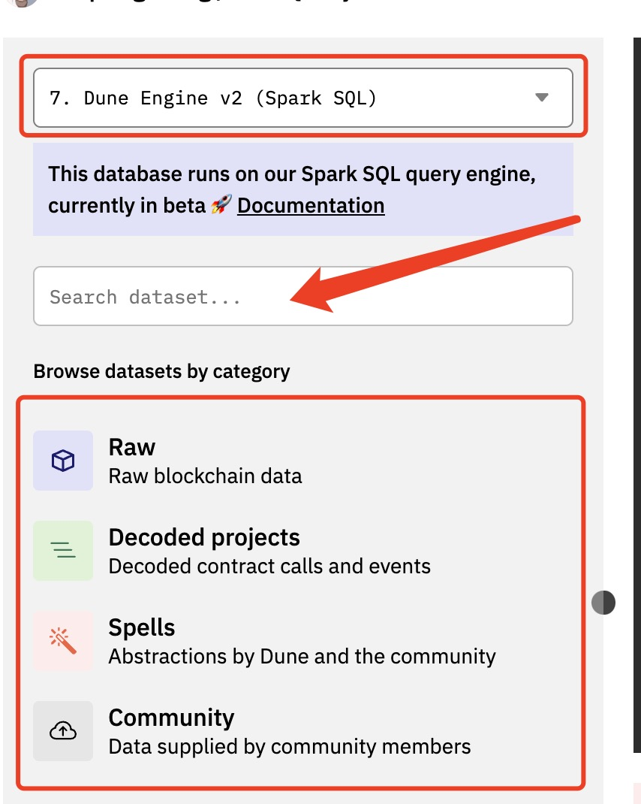
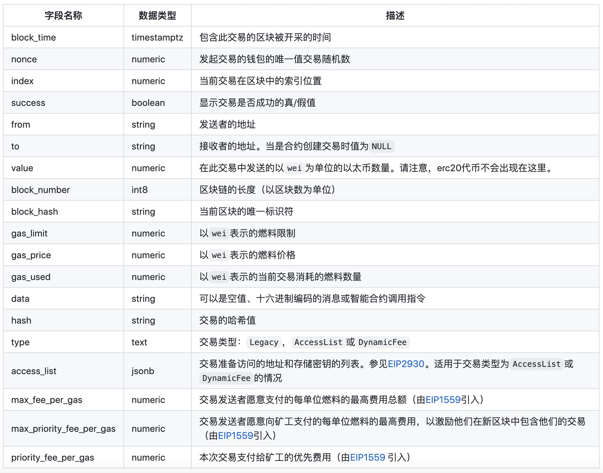

# 熟悉数据表

以Dune为代表的数据平台大多将区块链数据索引保存到数据库中从而可以使用SQL查询来访问数据。数据分析师针对具体项目的需求，通过编写SQL从相应的数据表中查询数据进行分析。目前市面上流行的区块链越来越多，全新的区块链还在不断涌现，每个链上面的各种类型的项目也层出不穷。如何快速找到要分析的项目对应的数据表是哪些，如何理解对应数据表里每个字段的含义、用途等，是每一个分析师必须掌握的技能。

目前我们熟悉的几个数据平台提供的基础数据集的整体结构基本相似，我们这里只围绕Dune平台来讲解。如果你更偏好使用其他平台，可以通过该平台对应的文档了解详情。由于Dune已经停止升级V1版本的数据引擎（目前仍然在做数据索引），我们只介绍其基于Spark SQL的V2中的数据集。

## Dune V2数据引擎数据表介绍

Dune 平台的数据集分为几种不同的类型：
- **原始数据（Raw）**：存储了未经编辑的、原始编码的区块链数据。包括blocks、transactions、traces等数据表。这些原始表保存了最原始的链上数据，可用于灵活的数据分析。
- **已解析项目（Decoded Projects）**：存储了经过解码后的智能合约事件及调用数据表。比如Uniswap V3相关的表，Opensea Seaport相关的表等。Dune使用智能合约的 ABI(Application Binary Interface) 和标准化代币智能合约的接口标准（ERC20、ERC721 等）来解码数据。
- **魔法表（Spells）**：魔法表在Dune V1中也叫抽象表（Abstractions），是Dune和社区用户一起通过spellbook github存储库来建设和维护并编译生成的数据表，这些数据表通常使用起来更为便捷高效。
- **社区贡献数据（Community）**：这部分是由第三方合作组织提供的数据源，自动接入到Dune的数据集里共分析师使用。目前Dune上主要有`flashbots`和`reservoir`两个数据集。
- **用户生成的数据表（User Generated Tables）**：目前Dune V2引擎尚未开放此功能，只能通过魔法表的方式来上传（生成）自定义数据表。V1引擎下用户可以通过SQL来创建表或视图。

在Dune平台的Query编辑页面，我们可以通过左边栏来选择或搜索需要的数据表。这部分界面如下图所示：

其中，上方的红框部分用于选择要使用的数据集，途中显示的“Dune Engine V2 (Spark SQL)”就是我们通常说的“V2 引擎”、“V2 Engine”或者“V2”，其他的则统称为“V1”。Dune V2 引擎基于Spark SQL（Databricks Spark），V1则是Postgresql，两种数据库引擎在SQL语法、支持的数据类型等方面有一些比较明显的区别。比如，在V1中，地址、交易哈希值这些是以`bytea`类型保存的，而在V2中，不存在`bytea`数据类型，地址、交易哈希值这些都是以小写字符串形势保存的。再如，V1中字符串对应的类型是`text`且不区分大小写，而在V2中字符串类型是`string`并且要区分大小写。

上图中下方的红框圈出的是前面所述Dune V2 引擎目前支持的几大类数据集。点击粗体文字标签即可进入下一级浏览该类数据集中的各种数据模式（Schema）以及各模式下具体的表格。点击进入下一级后，你还可以看到一个默认选项为“All Chains”的下拉列表，可以用来筛选你需要的区块链下的数据模式和数据表。图片中间的文本框可以用于搜索对应的模式或数据表。你可以用来搜索筛选那些包含了输入字符的模式和表。比如，输入`erc721`将筛选出名称包含这个字符串的所有魔法表和已解析项目表。

## 原始数据表

区块链中典型的原始数据表包括：区块表（Blocks）、交易表（Transactions）、内部合约调用表（Traces）、事件日志表（Logs）以及合约创建跟踪表（creation_traces）。部分区块链有更多或者更少的原始数据表，我们以以太坊为例做简单介绍。

### 区块表（ethereum.blocks）
区块（Block）是区块链的基本构建组件。一个区块包含多个交易记录。区块表记录了每一个区块生成的日期时间(block time)、对应的区块编号(block number)、区块哈希值、难度值、燃料消耗等信息。除了需要分析整个区块链的区块生成状况、燃料消耗等场景外，我们一般并不需要关注和使用区块表。其中最重要的区块生成日期时间和区块编号几乎都已经保存到了其他所有表中，只是对应的字段名称不同。

### 交易表（ethereum.transactions）

交易表保存了区块链上发生的每一个交易的详细信息（同时包括了成功或失败的交易）。以太坊的交易表结构如下图所示：

### 内部合约调用表（ethereum.traces）

交易（Transactions）可以触发修改以太坊虚拟机内部状态的更小的原子操作。有关这些操作执行的信息会被记录下来，并且可以存储为EVM执行内部合约，或者只是一个_内部合约_。在Etherscan中，这些被称为“内部交易”。

最大用途：记录原生Token 的转账、余额；合约创建

### 事件日志表（ethereum.logs）

此表存储了智能合约生成的所有事件日志。它对于查询尚未被解码或者由于代码非开源而无法解码的合约很有用。

## 已解析项目表

知道名称 -》 搜索名称
不知道名称知道地址 -》 检查 表

直接分级浏览随便看看

## 魔法表

简要说明创建方式

重点说明其中常用的表

## 社区贡献数据和用户生成数据表

参考文档链接

## SixDegreeLab介绍

SixDegreeLab（[@SixdegreeLab](https://twitter.com/sixdegreelab)）是专业的链上数据团队，我们的使命是为用户提供准确的链上数据图表、分析以及洞见，并致力于普及链上数据分析。通过建立社区、编写教程等方式，培养链上数据分析师，输出有价值的分析内容，推动社区构建区块链的数据层，为未来广阔的区块链数据应用培养人才。

欢迎访问[SixDegreeLab的Dune主页](https://dune.com/sixdegree)。

本文由SixDegreeLab成员Spring Zhang（[@superamscom](https://twitter.com/superamscom)）撰稿。因水平所限，不足之处在所难免。如有发现任何错误，敬请指正。
