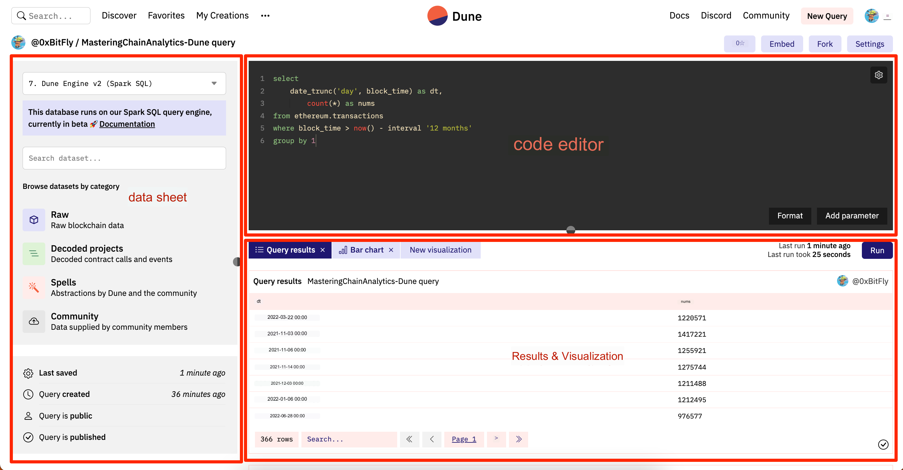
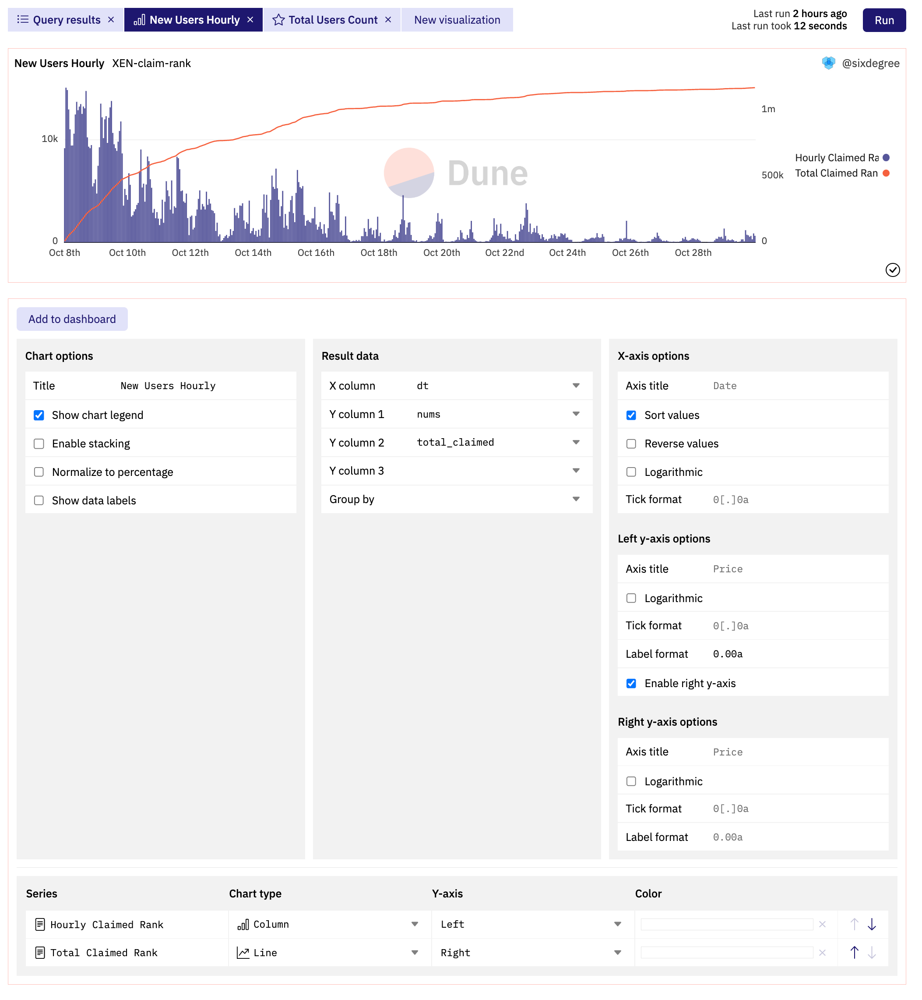
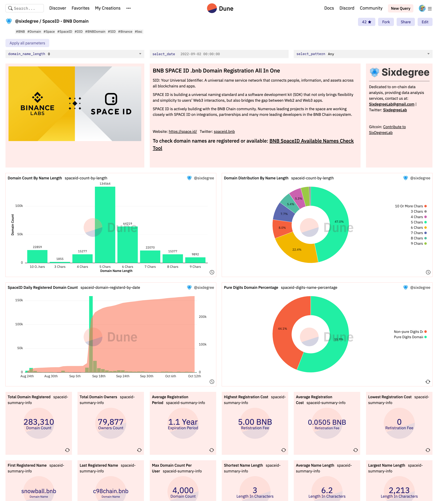

## Introduction to the Dune Platform
As mentioned earlier, from the perspective of the data stack, 
blockchain data products can be divided into three categories: 
`data sources`, `data development tools`, and `data apps`. 
Directly accessing data sources is costly and more difficult, 
while data apps are fixed. If we want to analyze data, 
we need a platform that does not require a large amount of development work 
and can access various data. Among these data development tools, 
the most convenient is the Dune platform.

[Dune](https://dune.com/) is an on-chain data analysis platform. 
Users can write SQL statements on the platform, filter out the data they need 
from the blockchain database parsed by Dune, and generate corresponding charts 
to form a dashboard.

All query examples and related queriesn in this tutorial - except for complete data dashboards and third-party account queries - have been tested and passed using the Dune SQL query engine. Dune has announced that it will fully transition to the Dune SQL engine within 2023, so that everyone can directly learn the syntax of Dune SQL.

## Webpage Introduction

After registering on the Dune platform, the main interface of the platform is as follows,
with specific functions:

- **Discover**: show various trends on the platform
  - **Dashboard**: displays the most followed dashboards. 
    On this page, you can search for keywords of interest in the search box 
    in the upper left corner/right side. This is the most important part.
    You can click on a dashboard to view other people's dashboards.
  - Queries: displays the most followed queries. On this page, 
    you can search for keywords of interest in the search box in the 
    upper left corner/right side.
  - Wizards: ranking of users with the highest collection volume on the platform.
  - Teams: ranking of teams with the highest collection volume on the platform.
- Favorites:
  - Dashboard: your favorite dashboards, which can be searched in the search box 
    on the right.
  - Queries: your favorite queries, which can be searched in the search box on the right.
- **My Creations**:
  - Dashboard: dashboards you created, which can be searched in the search box 
    on the right. If you have a team, the dashboard can be among different teams.
  - Queries: queries you created, which can be searched in the search box on the right.
  - Contracts: contracts you submitted for parsing, which can be searched 
    in the search box on the right.
- **New Query**: create a new query.
- **Others**:
  - Docs: link to the help documentation.
  - Discord: link to the community discussion group.

## Core Features

### Query

After clicking on `New Query`, you will enter a new interface, 
which consists of three main parts:

- Database Directory: On the left, there is a `data search box` and a `data list`.
  Expanding the data list will reveal each specific table. 
  (Note: The version displayed when you first enter is v1, which is deprecated. 
  Please select `Dune Engine v2(SparkSQL)` from the dropdown.)
  - Raw: Contains the original data tables of various blockchains, 
    mainly including block information (blocks), transaction information (transactions),
    event log information (logs), and traces tables, etc. 
    The currently supported chains include: Ethereum, Polygon, Arbitrum, Solana, Optimism,
    Gnosis Chain, Avalanche.
  - Decoded projects: Directly parsed tables of various projects/contracts. 
    The parsed tables will be clearer and easier to understand. 
    If you are analyzing specific projects, it would be more suitable to use the tables 
    here.
  - Spells: Comprehensive data tables extracted from raw and Decoded projects, 
    such as Dex, NFT, ERC20, etc.
  - Community: Data tables contributed by community users.

- Code Editor: Located in the upper right black area, 
  it is used for writing your own SQL statements. 
  After writing, you can click `Run` in the lower right corner to execute.
- Results & Chart Visualization: Located in the lower right, 
  the query results will be displayed in `Query results`, 
  and you can sequentially create new sub-visualization pages afterwards.

Queries on the platform can be forked, allowing you to copy someone else's query 
to your own account for modification and editing.

**Spellbook**

The spellbook is a very important data table on the Dune platform. It is a series 
of processed data tables contributed by community users. You can contribute your 
own defined data tables on the GitHub 
page [duneanalytics/spellbook](https://github.com/duneanalytics/spellbook). 
The Dune platform will generate corresponding data in the background based on 
this definition. In the frontend page shown above, you can directly use these 
predefined data tables. The definitions and field meanings of these data tables 
can be viewed here: [https://spellbook-docs.dune.com/#!/overview](https://spellbook-docs.dune.com/#!/overview)

At present, hundreds of various tables have been contributed by community users 
in the spellbook, such as nft.trades, dex.trades, tokens.erc20, etc.

**Parameters**

In the query, you can also set a variable input parameter to change the query conditions,
such as setting different user addresses or setting different time ranges. 
The parameter setting is embedded in the query statement in the form of`'{{parameter name}}'`.

### Visualization

In chart visualization, the Dune platform provides scatter plots, bar charts, 
line charts, pie charts, area charts, counters, and two-dimensional data tables. 
After executing the query and getting the results, you can choose `New visualization` 
to create a new visualization chart. In the chart, you can choose the data fields 
you want to display, and you can immediately get the corresponding visualization chart. 
The chart supports displaying data in multiple dimensions. 
The area below the chart is where you set the chart style, including name, axis format,
color, etc.

### Dashboard

The individual chart visualizations from the previous section can be 
flexibly combined in the dashboard to form an aggregated data indicator board 
with explanations, allowing for a more comprehensive perspective. 
In `Discover`, find `New Dashboard` to create a new dashboard. 
In the dashboard, you can add all the charts generated from queries, 
and you can add text information in markdown format. 
Each visualization widget can be dragged and resized.

### Dune Related Resources
- Official Resources
  - [Dune Official Documentation](https://dune.com/docs/)
  - [Discord](https://discord.com/invite/ErrzwBz)
  - [Youtube](https://www.youtube.com/channel/UCPrm9d2hLd_YxSExH7oRyAg)
  - [Github Spellbook](https://github.com/duneanalytics/spellbook)
- Community Tutorials
  - [Dune Data Dashboard Zero-Basic Minimalist Entry Guide](https://twitter.com/gm365/status/1525013340459716608)
  - [Dune Entry Guide - Make an NFT Dashboard with Pooly as an Example](https://mirror.xyz/0xa741296A1E9DDc3D6Cf431B73C6225cFb5F6693a/iVzr5bGcGKKCzuvl902P05xo7fxc2qWfqfIHwmCXDI4)
  - [Build Your Dune V1 Analytics Dashboard from 0 to 1 (Basic)](https://mirror.xyz/0xbi.eth/6cbedGOx0GwZdvuxHeyTAgn333jaT34y-2qryvh8Fio)
  - [Build Your Dune V1 Analytics Dashboard from 0 to 1 (Practical)](https://mirror.xyz/0xbi.eth/603BIaKXn7s2_7A84oayY_Fn5XUPh6zDsv2OlQTdzCg)
  - [Build Your Dune V1 Analytics Dashboard from 0 to 1 (Common Table Structures)](https://mirror.xyz/0xbi.eth/uSr336PzXtqMuE_LPBewbJ1CHN2oUs40-TDET2rnkqU)