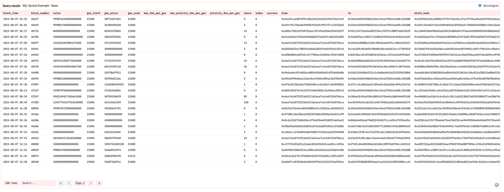
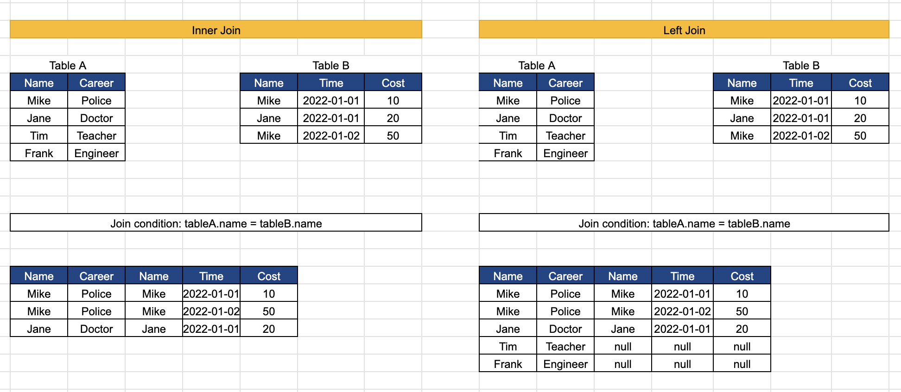

# SQL Basics (1)

## Basic Concepts

### 1. What is a data warehouse?

Simply put, a data warehouse is a structured storage of data for statistical purposes. The storage carrier is [**data tables**].  A series of [**data tables**] grouped together for one or multiple subjects is called a data warehouse. Note: the data here can be result data (e.g. daily trading volume of a trading pair on Uniswap since its launch) It can also be process data (every transaction record of a trading pair on Uniswap since launch: who initiated it, trading A for B, transaction time, tx_hash, amount, etc.).

**2. What is SQL?**

Let's say you want some crispy Nestle chocolate bars, but you can't go out right now. So you ask someone to run the errand for you: "I need a box of chocolate bars, the brand is Nestle". The errand runner goes to the supermarket, buys the chocolate and delivers it to your home.
Similarly, SQL is like the sentence you spoke, Dune Analytics is the errand runner. It allows you to converse with the data warehouse and retrieve data from it. The most basic structure or syntax of SQL has 3 components, almost all SQL will contain these 3 parts:

**select**: Which fields to retrieve?

**from**: From which table to retrieve?

**where**: What are the criteria?

**3. What does a data table look like?**

You can think of a table as an Excel sheet, with each sheet containing different data. Take `ethereum.transactions` (Ethereum transaction records) as an example:



There are some commonly used fields in tables:

- **block_time**: Timestamp when the transaction was mined
- **block_number**: Block height where the transaction was mined
- **value**: Amount of ETH transferred (need to divide by power(10,18) for decimal precision)
- **from**: Wallet address where the ETH was sent from
- **to**: Wallet address where the ETH was sent to
- **hash**: Transaction hash of this transaction
- **success**: Whether the transaction succeeded

## Common Syntax and Use Cases

### 1. Basic Structure, Operators, Sorting

**Case 1**: I want to see when Sun's wallet (0x3DdfA8eC3052539b6C9549F12cEA2C295cfF5296) had large ETH transfers (>1000 ETH) since January 2022, and the specific amounts transferred.

#### SQL

``` sql
select -- Select fields to query, separate multiple fields with commas
    block_time
    ,"from"
    ,"to"
    ,hash
    ,value /power(10,18) as value -- Convert value to decimal by dividing by power(10,18), 18 is Ethereum's precision
from ethereum.transactions -- Get data from ethereum.transactions table
where block_time > date('2022-01-01') -- Limit block_time to be after Jan 1, 2022
and "from" = 0x3DdfA8eC3052539b6C9549F12cEA2C295cfF5296 -- Limit to Sun's wallet
and value /power(10,18) >1000 -- Limit ETH transfer value > 1000
order by block_time -- Sort by block_time in ascending order,desc for descending order
```


#### Dune Query URL

[https://dune.com/queries/1523799](https://dune.com/queries/1523799)

#### Syntax Explanation

- SELECT
  - SELECT followed by fields to query, separate multiple fields with commas
- FROM
  - FROM followed by source table
- WHERE
  - WHERE followed by filters on the data
- Operators: and / or
  - Use operators to connect multiple filters
    - and: intersection of multiple filters
    - or: union of multiple filters
- Sorting: order by [fieldA], sort in ascending order by fieldA, add desc at the end for descending order
- Power calculation: used to convert Value precision, syntax is Power(Number, Power), where Number is base and Power is exponent
- Change case of strings
  - lower(): convert string to lowercase
  - upper(): convert string to uppercase

### 2. Aggregate Functions

**Case 2**: the table contains detailed data. I don't want to see the specifics, I just want to understand the overview through some aggregated stats.

#### SQL

``` sql
select
    sum( value /power(10,18) ) as value -- Sum the value field
    ,max( value /power(10,18) ) as max_value -- Get max value
    ,min( value /power(10,18) )  as min_value -- Get min value
    ,count( hash ) as tx_count -- Count number of rows
    ,count( distinct to ) as tx_to_address_count -- Count number of rows for qualifying data (dedupe by to address)
from ethereum.transactions -- Get data from ethereum.transactions table
where block_time > date('2022-01-01') -- Limit block_time to be after Jan 1, 2022
and "from" = 0x3DdfA8eC3052539b6C9549F12cEA2C295cfF5296
and value /power(10,18) > 1000 -- Limit ETH transfer value > 1000
```


#### Dune Query URL

[https://dune.com/queries/1525555](https://dune.com/queries/1525555)

#### Syntax Explanation

- Aggregate functions
  - count(): count, number of rows; add distinct inside () for dedupe
  - sum(): sum
  - min(): minimum
  - max(): maximum
  - avg(): average

### 3. Date/Time Functions, Aggregation by Groups

**Case 3**: I don't want to just see a single number, I want to see trends broken down by hour/day/week.

#### 3.1 Convert timestamp to hour/day/week format for further aggregated analysis

##### SQL

``` sql
-- Convert seconds-level timestamp to day/hour/minute (for further aggregation by day or hour)

select -- Select fields to query, separate multiple fields with commas
    block_time -- Timestamp of when the transaction happened
    ,date_trunc('hour',block_time) as stat_hour -- Convert to hour
    ,date_trunc('day',block_time) as stat_date -- Convert to day
    ,date_trunc('week',block_time) as stat_week -- Convert to week
    ,"from"
    ,"to"
    ,hash
    ,value /power(10,18) as value -- Convert value by dividing by power(10,18), 18 is Ethereum's precision
from ethereum.transactions -- Get data from ethereum.transactions table
where block_time > date('2021-01-01') -- Limit block_time to be after Jan 1, 2021
and "from" = 0x3DdfA8eC3052539b6C9549F12cEA2C295cfF5296
and value /power(10,18) >1000 -- Limit ETH transfer value > 1000
order by block_time -- Sort by block_time ascending, add desc at end for descending
```


##### Dune Query URL

[https://dune.com/queries/1527740](https://dune.com/queries/1527740)

##### Syntax Explanation

- DATE_TRUNC('datepart', timestamp)
  - Timestamp truncation function
  - Returns different results based on datepart parameter:
    - minute: Truncate timestamp to minute
    - hour: Truncate timestamp to hour
    - day: Truncate timestamp to day
    - week: Truncate timestamp to Monday of the week
    - year: Truncate timestamp to first day of the year

#### 3.2 Aggregate by groups using group by + sum based on the processed time fields from before

##### SQL

``` sql
select
    date_trunc('day',block_time) as stat_date
    ,sum( value /power(10,18) ) as value -- Sum the value field for qualifying data
from ethereum.transactions -- Get data from ethereum.transactions table
where block_time > date('2022-01-01') -- Limit block_time to be after Jan 1, 2022
and "from" = 0x3DdfA8eC3052539b6C9549F12cEA2C295cfF5296
and value /power(10,18) > 1000 -- Limit ETH transfer value > 1000
group by 1
order by 1
```


##### Dune Query URL

[https://dune.com/queries/1525668](https://dune.com/queries/1525668)

##### Syntax Explanation

- Aggregation by groups (`group by`):
  The syntax for aggregation by groups is `group by`. As the name suggests, it groups first then aggregates, and needs to be used together with aggregate functions.


Let's say the table above shows household expenses (3 people) for the first 2 months of 2020. If you just use `sum`, you would only get the total of 12900. If you want to get the 2 types of aggregated data on the right, you need to use group by (group by `Person` or group by `Month`).

### 4. Join, Subquery

**Case 4**: I want to look at Sun's transfers behavior from the perspective of USD value of ETH transferred out.

#### 4.1 The transfers show ETH's amount and I want to see the USD value for each transfer

##### SQL

``` sql
select
     block_time
     ,transactions_info.stat_minute  as stat_minute
    ,"from"
    ,"to"
    ,hash
    ,eth_amount -- Convert value by dividing by power(10,18), 18 is Ethereum's precision
    ,price
    ,eth_amount * price as usd_value
from
(
    select -- Select fields to query, separate multiple fields with commas
        block_time
        ,date_trunc('minute',block_time) as stat_minute -- Truncate block_time to minute as the primary key
        ,"from"
        ,"to"
        ,hash
        ,value /power(10,18) as eth_amount -- Convert value by dividing by power(10,18), 18 is Ethereum's precision
    from ethereum.transactions -- Get data from ethereum.transactions table
    where block_time > date('2022-01-01') -- Limit block_time to be after Jan 1, 2022
    and "from" = 0x3DdfA8eC3052539b6C9549F12cEA2C295cfF5296
    and value /power(10,18) >1000 -- Limit ETH transfer value > 1000
    order by block_time -- Sort by block_time ascending, add desc at end for descending
) transactions_info
left join -- Join transactions_info with price_info, using left join
(
    -- prices.usd table contains minute-level price data
    select
        minute as stat_minute
        ,price
    from prices.usd
    where blockchain = 'ethereum' -- Get Ethereum prices
    and symbol = 'WETH' -- Get WETH data
) price_info on transactions_info.stat_minute = price_info.stat_minute -- Join with stat_minute field
```


##### Dune Query URL

[https://dune.com/queries/1528027](https://dune.com/queries/1528027)

##### Syntax Explanation

- Join query
  - In most cases, the data we need is not in the same table. For example, the transactions table only contains transaction data, not price data. If we want to calculate the USD value of transactions, we need to join these two tables.
  - A join query can be understood as combining two tables based on some condition to form a virtual table. You can then easily process this virtual table.
- A join query has two components:
  - Join method (join, left join, right join, cross join, full join)
  - Join condition (on)
- The most commonly used are join and left join. Take these two examples to explain the specific usage



```
- join: Joins two tables based on the join condition (on), taking the intersection
  - Table A and Table B are joined on Name, the intersection is Xiaoming and  Xiaohong. Since join takes the intersection, the final result will only have Xiaoming and Xiaohong
  - All records from both tables that meet the criteria need to be joined. Because Table B has 2 records for Xiaoming, the joined result will also have 2 records for Xiaoming
  - left join: Takes the left table as primary and joins the right table on the join condition (on), filling with null if no join is found
  - Table A and Table B are joined on Name. Since the left table is primary, even though Xiaolan and Xiaoqing from the left table have no matching join records in the right table, Xiaolan and Xiaoqing will still appear in the result, with the right table portion filled with null.
```

#### 4.2 Aggregate the detailed data from 4.1 by day, without too many levels of nested SQL

##### SQL

``` sql
with transactions_info as -- Create subquery named transactions_info
(
    select
         block_time
         ,transactions_info.stat_minute  as stat_minute
        ,"from"
        ,"to"
        ,hash
        ,eth_amount -- Convert value by dividing by power(10,18), 18 is Ethereum's precision
        ,price
        ,eth_amount* price as usd_value
    from
    (
        select -- Select fields to query, separate multiple fields with commas
            block_time
            ,date_trunc('minute',block_time) as stat_minute -- Truncate block_time to minute
            ,"from"
            ,"to"
            ,hash
            ,value /power(10,18) as eth_amount -- Convert value by dividing by power(10,18), 18 is Ethereum's precision
        from ethereum.transactions -- Get data from ethereum.transactions table
        where block_time > date('2022-01-01') -- Limit block_time to be after Jan 1, 2022
            and "from" = 0x3DdfA8eC3052539b6C9549F12cEA2C295cfF5296
            and value /power(10,18) >1000 -- Limit ETH transfer value > 1000
        order by block_time -- Sort by block_time ascending, add desc at end for descending
    ) transactions_info
    left join -- Join transactions_info with price_info, using left join
    (
        -- prices.usd table contains minute-level price data
        select
            minute as stat_minute
            ,price
        from prices.usd
        where blockchain = 'ethereum' -- Get Ethereum prices
            and symbol = 'WETH' -- Get WETH data
    ) price_info on transactions_info.stat_minute = price_info.stat_minute -- Join key is stat_minute
)

select date_trunc('day',block_time) as stat_date
    ,sum(eth_amount) as eth_amount
    ,sum(usd_value) as usd_value
from transactions_info -- Get data from 'virtual table' transactions_info
group by 1
order by 1
```


##### Dune Query URL

[https://dune.com/queries/1528564](https://dune.com/queries/1528564)

##### Syntax Explanation

- Subquery (with as)
  - with as can be used to construct a subquery, turning the result of some SQL into a 'virtual table' (similar to a view or subquery). The subsequent SQL can then directly retrieve data from this 'virtual table'.
  - Through with as, the readability of SQL logic can be improved, and multiple nestings can also be avoided.
