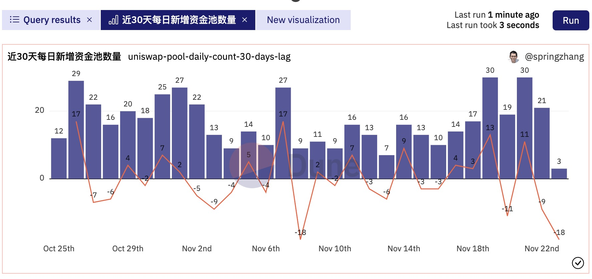
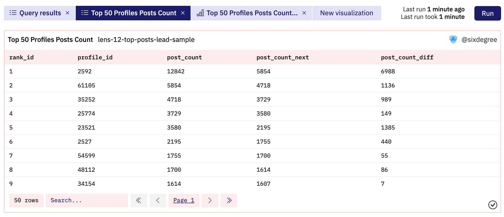
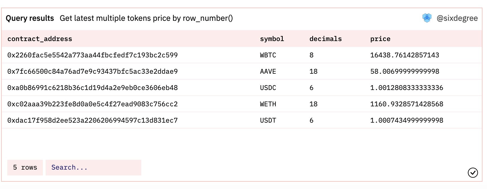

# SQL syntax (II)

In the "SQL syntax (I)" section, we covered the fundamentals of SQL,including SQL query statement infrastructure syntax, datetime, group by, with as and join.Next, we continue to introduce some common fundamentals of SQL.

## Commonly used Date functions and Interval

In the context of blockchain, data is recorded and stored in the order of transaction occurrences. When conducting daily data analysis, it is often necessary to perform statistical operations on data within specific time periods. In the previous section, we introduced the `date_trunc()` function, which allows us to truncate date values at specified intervals such as days, weeks, or hours. Furthermore, there are several commonly used functions and their respective usage.

### 1.Now() and Current_Date() functions

The `now()` function is used to get the date and time of the current system.Note that it is internally stored with hour, minute and second values, but Dune's query editor only displays "hour:minute" by default.When we want to correlate the date field with the `minute` field in the `prices.usd` table, we must first intercept by minute.Otherwise,the correct price record may not be associated.

The  `current_date()` function is used to get the current date (without the hours, minutes and seconds part).When filtering data by date and time, we often need to combine these functions and use relevant date functions to obtain the exact date or time. The `current_date()` function is equivalent to using `date_trunc('day', now())`, which extracts the day value from the result of `now()`. You can also omit the parentheses of `current_date()` and write it as `current_date` directly.

``` sql
select now() -- current datetime
    ,current_date() -- current date
    ,current_date   -- current date
    ,date_trunc('day', now()) -- same as current_date
```
    
### 2.DateAdd(), Date_Add(), Date_Sub() and DateDiff() functions

The `dateadd(unit, value, expr)` function  adds a datetime unit to a date expression. Here the "date and time units" using constants, commonly used are HOUR, DAY, WEEK, MONTH and so on.The value can be a negative number, which means that the corresponding date and time unit is subtracted from the following expression.It is also because a negative number can be used to indicate the subtraction of a datetime interval that the `datesub()` function is not needed and indeed not available.

The `date_add(startDate, numDays)` function adds or subtracts the specified number of days to a date expression and returns another date.Parameter numDays for a positive number of days after the specified date to return to the `startDate`, for a negative number of days before the specified date to return.The function `date_sub (startDate, numDays)`is similar, but the meaning of the opposite, a negative number indicates the date after the return, and a positive number indicates the previous date.

The function `datediff(endDate, startDate)` returns the number of days between two date expressions.If `endDate` is after `startDate`, it returns a positive value, before it returns a negative value.

The SQL example is as follows:

``` sql
select date_add('MONTH', 2, current_date) -- Add 2 months to current date
    ,date_add('HOUR', 12, now()) -- Add 12 hours to current date
    ,date_add('DAY', -2, current_date) -- Subtract 2 days to current date 
    ,date_add('DAY', 2, current_date) -- Add 2 days to current date
    ,date_add('DAY', -5, current_date) -- Subtract 5 days to current date 
    ,date_diff('DAY', date('2022-11-22'), date('2022-11-25')) -- the difference between two date, return negtivate value
    ,date_diff('DAY', date('2022-11-25'), date('2022-11-22'))  -- the difference between two date, return positive value
```

### 3.INTERVAL type

Interval is a datatype that represents an interval of time in specified datetime units. The time interval represented by Interval is very convenient to use, avoiding being troubled by the previous date functions with similar names and similar functions.

``` sql
select now() - interval '2' hour -- 2 hours ago
    ,current_date - interval '7' day -- 7 days ago
    ,now() + interval '1' month -- 1 month after now
```

For a description of more date-time related functions, see [Date and time functions and operators](https://trino.io/docs/current/functions/datetime.html)
<a id="jump_8"></a>

## Conditional expressions Case, If

When conditional logic needs to be applied, the `case` statement can be used. The general syntax for the CASE statement is `CASE {WHEN cond1 THEN res1} [...] [ELSE def] END`. This statement allows an expression to be evaluated under multiple conditions and returns the value corresponding to the first condition that evaluates to True. If none of the conditions are satisfied, the value specified after `else` is returned. The `else` part is optional, and if omitted, NULL is returned.

We have used the CASE statement many times in the "Lens Practice Case: Creator Profile Domain Name Analysis" section. Some of the code excerpts are as follows:

``` sql
-- ...skip some code...

profiles_summary as (
    select (
            case
                when length(short_name) >= 20 then 20 -- if the length of profile name greater than 20, then set to 20
                else length(short_name) -- if the length of profile name less than 20, use the original length
            end) as name_length, -- rename case column to a new name
        handle_type,
        count(*) as name_count
    from profile_created
    group by 1, 2
),

profiles_total as (
    select count(*) as total_profile_count,
        sum(case
                when handle_type = 'Pure Digits' then 1 -- if the handle_type equal to 'Pure Digits', return 1
                else 0  -- else return 0
            end
        ) as pure_digit_profile_count,
        sum(case 
                when handle_type = 'Pure Letters' then 1 
                else 0  
            end
        ) as pure_letter_profile_count
    from profile_created
)

-- ...省略部分代码...
```

As you can see, through the CASE statement we can flexibly convert the data according to actual needs to facilitate subsequent statistical summary.

Related links for the above example query:

- Query:[https://dune.com/queries/1535541](https://dune.com/queries/1535541)
- Description: [Lens Creator Profile Domain Name Analysis](https://sixdegreelab.gitbook.io/mastering-chain-analytics/ru-men-jiao-cheng/06_pratical_case_lens_protocol)

The function `if(cond, expr1, expr2)` returns one of two expressions, depending on whether the condition evaluates to true or false. If the condition evaluates to a true value, the first expression is returned, and if it evaluates to a false value, the second expression is returned.

``` sql
select if(1 < 2, 'a', 'b') -- if the condition result is true, return 'a', else return 'b'
    ,if('a' = 'A', 'case-insensitive', 'case-sensitive') 
 ```

## Common functions for string processing

1. Substring() function

When there are certain situations where we have to work with the original data table `transactions` or `logs` and decode the `data` therein, we need to extract part of the string from it first, and then carry out the targeted conversion process, at this time we need to use the Substring function. The syntax of the Substring function is `substring( expr, pos [, len])` or `substring (expr FROM pos [FOR len] ] )`, that in the expression `expr`, starting from the position `pos`, intercept `len` characters and return. If `len` is omitted, the string is intercepted until the end of the string.

2. Concat() Function and the || Operator

The function `concat(expr1, expr2 [, ...])` strings multiple expressions together. ) concatenates multiple expressions together and is often used to link strings. The operator `||` has the same function as Concat.

``` sql
select concat('a', ' ', 'b', ' c') -- concat multi string
    , 'a' || ' ' || 'b' || ' c' -- same as concat
```

3. Right() function

"The `right(str, len)` function retrieves `len` characters from the right side of the string `str`. In our case, the original data table, like `logs`, contains connected groups of 64 characters stored in the `data`.For the contract address or user address, it is represented by 40 characters.  When saving, it will be filled with `0` on the left to make up the 64-bit length. When extracting the address, we need to retrieve the 40 rightmost characters and add the '0x' prefix to restore it to the correct address format.

Note that in Dune SQL, directly using the `right()` function may return a syntax error, which can be solved by putting the function name in double quotes, that is, using `"right"()`. Since this method is cumbersome, you can leverage the substring function with a negative start position parameter to perform the right-side extraction with ease.

The following is a comprehensive example of using the above functions. This example decodes the cross-chain to Arbitrum records from the `logs` table, using several methods comprehensively:

``` sql
select date_trunc('day', block_time) as block_date, --truncate a timestamp to day
    concat('0x', "right"(substring(cast(data as varchar), 3 + 64 * 2, 64), 40)) as address, -- Extract the third part of the data column and convert it into an address, starting from the third character, each 64 characters as a group.
    concat('0x', "right"(substring(cast(data as varchar), 3 + 64 * 3, 64), 40)) as token, -- Extract part 4 of data and convert it to address
    concat('0x', substring(substring(cast(data as varchar), 3 + 64 * 3, 64), -40, 40)) as same_token, -- Extract part 4 of data and convert it to address
    substring(cast(data as varchar), 3 + 64 * 4, 64) as hex_amount, -- Extract part 5 of data column
    bytearray_to_uint256(bytearray_substring(data, 1 + 32 * 4, 32)) as amount, -- Extract part 5 of data column and convert it to decimal
    tx_hash
from ethereum.logs
where contract_address = 0x5427fefa711eff984124bfbb1ab6fbf5e3da1820   -- Celer Network: cBridge V2 
    and topic0 = 0x89d8051e597ab4178a863a5190407b98abfeff406aa8db90c59af76612e58f01  -- Send
    and substring(cast(data as varchar), 3 + 64 * 5, 64) = '000000000000000000000000000000000000000000000000000000000000a4b1'   -- 42161
    and substring(cast(data as varchar), 3 + 64 * 3, 64) = '000000000000000000000000c02aaa39b223fe8d0a0e5c4f27ead9083c756cc2' -- WETH
    and block_time >= now() - interval '30' day
limit 10
```

Related links for the example query above:

- Query:[https://dune.com/queries/1647016](https://dune.com/queries/1647016)
- Description: [String Functions and Operators](https://trino.io/docs/current/functions/string.html)

## Window function

The combination of multiple rows of data becomes a window (Window). A function that operates on a set of rows in a window and calculates the return value for each row based on the set of rows is called a window function.Window functions prove invaluable for various processing tasks, such as computing moving averages, cumulative statistics, or accessing the value of a row based on its relative position within the current row's window.The common syntax format of a window function is as follows:"

``` sql
function OVER window_spec
```

Among them, `function` can be a ranking window function, an analysis window function or an aggregation function. `Over` is a fixed keyword that must be used. There are two possible changes in the `window_spec` part: partition by `partition_feild order by order_field` or `order by order_field`, respectively indicating partition first and then sort and direct sort without partition. Except for the case where all rows are treated as the same group, the grouping function must be used with `order by`.

1. LEAD(), LAG() functions

The Lead() function returns the value of the specified expression from subsequent rows within the partition. Its syntax is `lead(expr [, offset [, default] ] )`. The Lag() function returns the value of the specified expression from the preceding row in the partition. These two functions are very useful when we need to compare the value of a column in the result set with the value of the same column in the previous or next row (of course, values can also be taken at intervals of multiple rows).

Our previous tutorial described a query to count the number of new pools added daily to Uniswap V3 for the last 30 days. Its SQL is:

``` sql
with pool_details as (
    select date_trunc('day', evt_block_time) as block_date, evt_tx_hash, pool
    from uniswap_v3_ethereum.Factory_evt_PoolCreated
    where evt_block_time >= now() - interval '29' day
)

select block_date, count(pool) as pool_count
from pool_details
group by 1
order by 1
```

If we want to add a curve to show the change in the number of new fund pools every day based on the current bar chart, we can use the Lag() function to calculate the change value of each day compared to the previous day, and then visualize it. In order to keep the logic clear, we added a CTE, and the modified SQL is as follows:

``` sql
with pool_details as (
    select date_trunc('day', evt_block_time) as block_date, evt_tx_hash, pool
    from uniswap_v3_ethereum.Factory_evt_PoolCreated
    where evt_block_time >= now() - interval '29' day
),

pool_summary as (
    select block_date,
        count(pool) as pool_count
    from pool_details
    group by 1
    order by 1
)

select block_date,
    pool_count,
    lag(pool_count, 1) over (order by block_date) as pool_count_previous, -- use the lag function to get previous day
    pool_count - (lag(pool_count, 1) over (order by block_date)) as pool_count_diff -- Subtract to get the change value
from pool_summary
order by block_date
```

Add `pool_count_diff` to the visualisation chart (using the right hand axis and choosing Line for the graph type) as shown below:



The Lead() function proves to be a valuable tool when we wish to perform "forward" comparisons of data across various rows. For example, we previously prpesented a query that identified the creator accounts with the highest post counts in the Lens instance. Now, we shall refine this query to retrieve the top 50 accounts with the highest post counts. With this refined dataset, we can delve into comparing the differences in the number of posts among these top accounts. Specifically, we will examine the variance between the first and second positions, the second and third positions, and so on.The key part of the query code is as follows:

``` sql
with post_data as (
    -- To obtain the detailed data of the original post, please refer to the Dune SQL link
),

top_post_profiles as (
    select profile_id,
        count(*) as post_count
    from post_data
    group by 1
    order by 2 desc
    limit 50
)

select row_number() over (order by post_count desc) as rank_id, -- Generate consecutive numbers to indicate ranking
    profile_id,
    post_count,
    lead(post_count, 1) over (order by post_count desc) as post_count_next, -- Get the post data of the next line
    post_count - (lead(post_count, 1) over (order by post_count desc)) as post_count_diff -- Calculate the difference between the number of posts in the current row and the next row
from top_post_profiles
order by post_count desc
```
The query results are shown in the figure below, where we can see that there are very small differences in the number of posts between some accounts:



Full SQL reference link:
- [https://dune.com/queries/1647422](https://dune.com/queries/1647422)

2. Row_Number() function

Row_Number() is a powerful window function of the ranking type, primarily used to assign distinct row numbers based on a specified sorting method. These row numbers start from 1 and increment consecutively. In a previous example, we employed Row_Number() with the syntax `row_number() over (order by post_count desc) as rank_id` to generate row numbers representing the ranking of our data, so we won't delve into another example here.If combined with the `partition by` partition clause, Row_Number() will start numbering from 1 within each partition. Using this feature, we can use it to implement some advanced screening. For example, we have a group of Token addresses, and we need to calculate and return their average price in the last 1 hour.Due to potential delays in data from sources like Dune, filtering by the "hour" value of the current system date may not always yield the desired price data. To ensure accuracy, a more cautious approach is to widen the time range and then filter out the most recent record for each Token. This way, even if the data is delayed by several hours, our queries will continue to function correctly.To achieve this, we can utilize the Row_Number() function along with the `partition by` clause. The process involves generating row numbers for each partition, and then filtering out the required data based on these row numbers.

``` sql
with latest_token_price as (
    select date_trunc('hour', minute) as price_date, -- group by hour
        contract_address,
        symbol,
        decimals,
        avg(price) as price -- Calculate average price
    from prices.usd
    where contract_address in (
        0xdac17f958d2ee523a2206206994597c13d831ec7,
        0x2260fac5e5542a773aa44fbcfedf7c193bc2c599,
        0xc02aaa39b223fe8d0a0e5c4f27ead9083c756cc2,
        0xa0b86991c6218b36c1d19d4a2e9eb0ce3606eb48,
        0x7fc66500c84a76ad7e9c93437bfc5ac33e2ddae9
    )
    and minute > now() - interval '1' day -- Fetch data within the last day to make sure it works well even if the data is delayed
    group by 1, 2, 3, 4
),

latest_token_price_row_num as (
    select  price_date,
        contract_address,
        symbol,
        decimals,
        price,
        row_number() over (partition by contract_address order by price_date desc) as row_num -- Generate row numbers by contract_address
    from latest_token_price
)

select contract_address,
    symbol,
    decimals,
    price
from latest_token_price_row_num
where row_num = 1 -- Filter out the latest average price of each token by row number 1
```

The above query results are shown in the figure below:



Full SQL reference link:
- [https://dune.com/queries/1647482](https://dune.com/queries/1647482)

More complete information on window functions:
- [Window functions](https://trino.io/docs/current/functions/window.html)

## Array_agg() function

If you want to combine a certain column of each row of data in the query result set, you can use the array_agg() function. If you want to merge multiple columns of data together (imagine exporting the query results as CSV), you can consider using the string concatenation method described above to combine multiple columns of data into one column, and then apply the array_agg() function. Here is a simple example:

``` sql
select array_agg(contract_address) from
(
    select contract_address 
    from ethereum.logs
    where block_time >= current_date
    limit 10
) t
```

## Summary

Each database has dozens or even hundreds of built-in functions, and what we introduce here is only a small part of the commonly used functions. If you want to become a proficient data analyst, we highly recommend reading and understanding the usage of each of the built-in functions here:[Trino 函数](https://trino.io/docs/current/functions.html).

## About Us

`Sixdegree` is a professional onchain data analysis team Our mission is to provide users with accurate onchain data charts, analysis, and insights. We are committed to popularizing onchain data analysis. By building a community and writing tutorials, among other initiatives, we train onchain data analysts, output valuable analysis content, promote the community to build the data layer of the blockchain, and cultivate talents for the broad future of blockchain data applications. Welcome to the community exchange!

- Website: [sixdegree.xyz](https://sixdegree.xyz)
- Email: [contact@sixdegree.xyz](mailto:contact@sixdegree.xyz)
- Twitter: [twitter.com/SixdegreeLab](https://twitter.com/SixdegreeLab)
- Dune: [dune.com/sixdegree](https://dune.com/sixdegree)
- Github: [https://github.com/SixdegreeLab](https://github.com/SixdegreeLab)