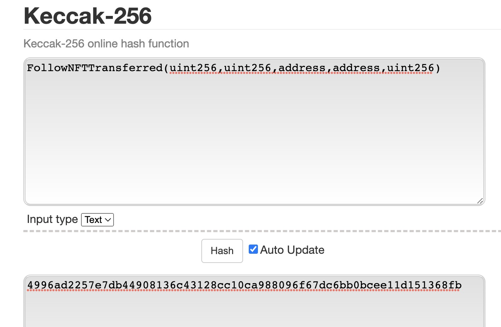
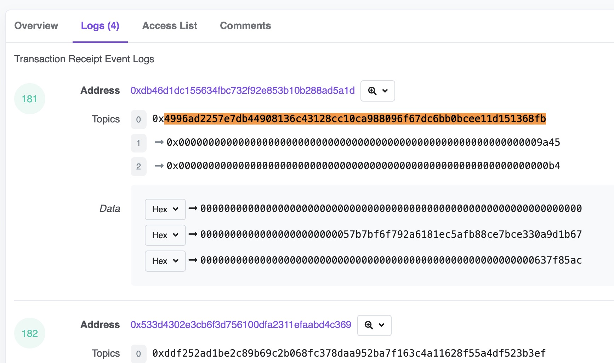
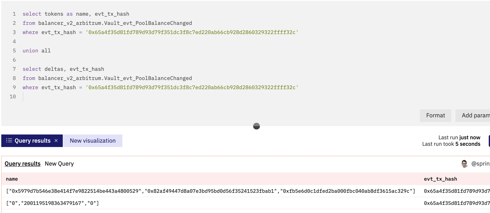
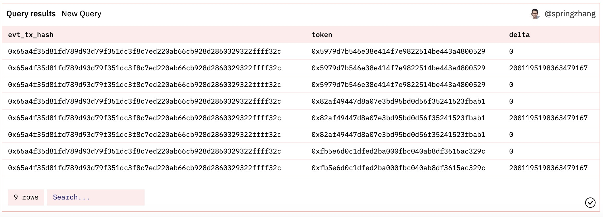

# Useful query part3: custom data, number sequence, array, JSON, etc

In the first two parts of common queries, we introduced some common query methods such as price query, holder, and holding balance of ERC20 tokens. In this section, we'll look at some other common queries.

##  Custom data table using CTE

Dune V2 does not currently support user-custom tables and views. For some data from external sources or a small amount of manually curated data, we can consider using CTE to generate a custom list of data within the query. It can support custom CTE tables with thousands of rows with only a few fields and that they will execute successfully as long as they do not exceed the maximum size of the Dune query request. There are two ways to customize CTE tables: 

Example of the first syntax: 
``` sql
with raydium_lp_pairs(account_key, pair_name) as (
    values
    ('58oQChx4yWmvKdwLLZzBi4ChoCc2fqCUWBkwMihLYQo2', 'SOL/USDC'),
    ('7XawhbbxtsRcQA8KTkHT9f9nc6d69UwqCDh6U5EEbEmX', 'SOL/USDT'),
    ('AVs9TA4nWDzfPJE9gGVNJMVhcQy3V9PGazuz33BfG2RA', 'RAY/SOL'),
    ('6UmmUiYoBjSrhakAobJw8BvkmJtDVxaeBtbt7rxWo1mg', 'RAY/USDC'),
    ('DVa7Qmb5ct9RCpaU7UTpSaf3GVMYz17vNVU67XpdCRut', 'RAY/USDT'),
    ('GaqgfieVmnmY4ZsZHHA6L5RSVzCGL3sKx4UgHBaYNy8m', 'RAY/SRMSOL'),
    ('6a1CsrpeZubDjEJE9s1CMVheB6HWM5d7m1cj2jkhyXhj', 'STSOL/USDC'),
    ('43UHp4TuwQ7BYsaULN1qfpktmg7GWs9GpR8TDb8ovu9c', 'APEX4/USDC')
)

select * from raydium_lp_pairs
```

Example of the second syntax: 

``` sql
with token_plan as (
    select token_name, hook_amount from (
        values
        ('Token Type','BEP-20 on BNB Chain'),
        ('Total Token Supply','500,000,000 HOOK'),
        ('Private Sale Allocation','100,000,000 HOOK'),
        ('Private Sale Token Price','0.06 USD to 0.12 USD / HOOK'),
        ('Private Sale Amount Raised','~ 6,000,000 USD'),
        ('Binance Launchpad Sale Allocation','25,000,000 HOOK'),
        ('Binance Launchpad Sale Price','0.10 USD / HOOK'),
        ('Binance Launchpad Amount to be Raised','2,500,000 USD'),
        ('Initial Circ. Supply When Listed on Binance','50,000,000 HOOK (10.00%)')
    ) as tbl(token_name, hook_amount)
)

select * from token_plan
```

Of course, with the second syntax, you can omit the CTE definition and use the SELECT query directly if you happen to only need to return this part of the custom data.

Example link to the above query: 
- [https://dune.com/queries/781862](https://dune.com/queries/781862)
- [https://dune.com/queries/1650640](https://dune.com/queries/1650640)

Due to the limitations mentioned earlier, the execution may not succeed when there are too many rows. You will need to duplicate the same CTE code for every query, which is relatively inconvenient. For large amounts of data, multiple times, long-term use, etc., you should still consider generating the spells table by submitting spellbook PR.

## Decode data from the logs

Earlier in calculating the price of ERC20 tokens, we saw an example of calculating the price from logs. Let's look at another example where we need to decode data directly from logs. When the smart contract is not decoded by Dune, or the decode table for the corresponding event is not generated because the ABI data used during decoding is incomplete, we may need to decode the query data directly from the logs. Taking the Lens protocol as an example, we found that in the Lens smart contract source code ([Lens Core](https://github.com/lens-protocol/core)), almost every operation has generated event logs. However, there are only a few event-related tables in Dune's decoded data. Further investigation revealed that the ABI used during decoding was missing the definition of these events. Although we can regenerate or get the Lens team to get the full ABI and submit it to Dune to parse again, the main point here is how to extract data from the undecoded logs.

In the Lens smart contract source code, we see the `FollowNFTTransferred` event definition, [code link](https://github.com/lens-protocol/core/blob/main/contracts/libraries/Events.sol#L347). There is also a `Followed` event in the code, but decoding is complicated by the array argument, so we'll use the previous event as an example. From the event name, we can infer that when a user follows a Lens Profile, a FollowNFT will be generated and transferred to the follower's address. We can  then find a transaction record of interest. Let's look at the logs inside for the following transaction:[https://polygonscan.com/tx/0x30311c3eb32300c8e7e173c20a6d9c279c99d19334be8684038757e92545f8cf](https://polygonscan.com/tx/0x30311c3eb32300c8e7e173c20a6d9c279c99d19334be8684038757e92545f8cf). The transaction Logs page in our browser and switch to the "Logs" TAB, so we can see that there are four event logs in total. In certain instances, the blockchain browser can display the original event name. The Lens transaction we're looking at doesn't show the original name, so how do we know which one corresponds to the `FollowNFTTransferred` event log? Here we can use third-party tools to compare by generating the keccak256 hash of the event definition. [Keccak - 256](https://emn178.github.io/online-tools/keccak_256.html) this page can generate online Keccak - 256 hash value. Let's clean up the definition of the `FollowNFTTransferred` event in the source code to a minified mode (remove parameter names, remove Spaces), Get ` FollowNFTTransferred (uint256 uint256, address, the address, uint256) `, then paste it to Keccak - 256 tool page, The generated hash value for ` 4996ad2257e7db44908136c43128cc10ca988096f67dc6bb0bcee11d151368fb `. (The latest Dune parse table already has the full event table for the Lens project, here is just for example purposes)



Using this hash, we can search Polygonscan's transaction log list to find a match. You can see that the first log entry is exactly what we're looking for.



After finding the corresponding log record, with the event definition, we can easily decode the data:

``` sql
select block_time,
    tx_hash,
    bytearray_to_uint256(topic1) as profile_id, --  the followed Profile ID
    bytearray_to_uint256(topic2) as follower_token_id, -- follower's NFT Token ID
    bytearray_ltrim(bytearray_substring(data, 1, 32)) as from_address2, -- address (out)
    bytearray_ltrim(bytearray_substring(data, 1 + 32, 32)) as to_address2 -- address (in)(address of the follower)
from polygon.logs
where contract_address = 0xdb46d1dc155634fbc732f92e853b10b288ad5a1d -- Lens contract address
    and block_time >= date('2022-05-01') -- The Lens contract is deployed after this date, and this condition is used to improve query speed
    and topic0 = 0x4996ad2257e7db44908136c43128cc10ca988096f67dc6bb0bcee11d151368fb   -- Event topic FollowNFTTransferred
limit 10
```

Example link to the above query:
- [https://dune.com/queries/1652759](https://dune.com/queries/1652759)
- [Keccak-256 Tool](https://emn178.github.io/online-tools/keccak_256.html)

## Use sequences of numbers to simplify queries

When studying NFT projects, we may want to analyze the distribution of prices of all transactions for a given NFT project during a certain time period (i.e., how many transactions were recorded in each price range). We typically set the minimum and maximum transaction prices (either by input or by querying the transaction data and handling outliers), divide the range into N ranges, and count the number of transactions in each range. Here is an example of a query that is simple in logic but cumbersome in comparison:

``` sql
-- nft Position cost distribution
-- 0x306b1ea3ecdf94ab739f1910bbda052ed4a9f949 beanz
-- 0xED5AF388653567Af2F388E6224dC7C4b3241C544 azuki
with contract_transfer as (
    select * 
    from nft.trades
    where nft_contract_address = 0xe361f10965542ee57D39043C9c3972B77841F581
        and tx_to != 0x0000000000000000000000000000000000000000
        and amount_original is not null
),

transfer_rn as (
    select row_number() over (partition by token_id order by block_time desc) as rn, *
    from contract_transfer
),

latest_transfer as (
    select * from transfer_rn
    where rn = 1 
),

min_max as (
    select (cast({{max_price}} as double) - cast({{min_price}} as double))/20.0 as bin
),

bucket_trade as (select *,
    case 
      when amount_original between {{min_price}}+0*bin and {{min_price}}+1*bin then 1*bin
      when amount_original between {{min_price}}+1*bin and {{min_price}}+2*bin then 2*bin
      when amount_original between {{min_price}}+2*bin and {{min_price}}+3*bin then 3*bin
      when amount_original between {{min_price}}+3*bin and {{min_price}}+4*bin then 4*bin
      when amount_original between {{min_price}}+4*bin and {{min_price}}+5*bin then 5*bin
      when amount_original between {{min_price}}+5*bin and {{min_price}}+6*bin then 6*bin
      when amount_original between {{min_price}}+6*bin and {{min_price}}+7*bin then 7*bin
      when amount_original between {{min_price}}+7*bin and {{min_price}}+8*bin then 8*bin
      when amount_original between {{min_price}}+8*bin and {{min_price}}+9*bin then 9*bin
      when amount_original between {{min_price}}+9*bin and {{min_price}}+10*bin then 10*bin
      when amount_original between {{min_price}}+10*bin and {{min_price}}+11*bin then 11*bin
      when amount_original between {{min_price}}+11*bin and {{min_price}}+12*bin then 12*bin
      when amount_original between {{min_price}}+12*bin and {{min_price}}+13*bin then 13*bin
      when amount_original between {{min_price}}+13*bin and {{min_price}}+14*bin then 14*bin
      when amount_original between {{min_price}}+14*bin and {{min_price}}+15*bin then 15*bin
      when amount_original between {{min_price}}+15*bin and {{min_price}}+16*bin then 16*bin
      when amount_original between {{min_price}}+16*bin and {{min_price}}+17*bin then 17*bin
      when amount_original between {{min_price}}+17*bin and {{min_price}}+18*bin then 18*bin
      when amount_original between {{min_price}}+18*bin and {{min_price}}+19*bin then 19*bin
      when amount_original between {{min_price}}+19*bin and {{min_price}}+20*bin then 20*bin
      ELSE 21*bin
    end as gap
  from latest_transfer,min_max
 )

select gap, count(*) as num
from bucket_trade
group by gap
order by gap 
```

In this example, we define two parameters `min_price` and `max_price`, divide their difference equally into 20 price bands, and then use a lengthy CASE statement to count the number of transactions in each band. Imagine if you had to break it up into 50 groups. Is there an easier way? The answer is yes. Look at the code first: 

``` sql
with contract_transfer as (
    select * 
    from nft.trades
    where nft_contract_address = 0xe361f10965542ee57D39043C9c3972B77841F581
        and tx_to != 0x0000000000000000000000000000000000000000
        and amount_original is not null
),

transfer_rn as (
    select row_number() over (partition by token_id order by block_time desc) as rn, *
    from contract_transfer
),

latest_transfer as (
    select *
    from transfer_rn
    where rn = 1 
),

min_max as (
    select (cast({{max_price}} as double) - cast({{min_price}} as double))/20.0 as bin
),

-- Generates a single column table with numbers from 1 to 20
num_series as (
    select num from unnest(sequence(1, 20)) as tbl(num)
),

-- Generates the start and end prices of the group price range
bin_gap as (
    select (num - 1) * bin as gap,
        (num - 1) * bin as price_lower,
        num * bin as price_upper
    from num_series
    join min_max on true
    
    union all
    
    -- Add an additional interval to cover other data
    select num * bin as gap,
        num * bin as price_lower,
        num * 1e4 * bin as price_upper
    from num_series
    join min_max on true
    where num = 20
),

bucket_trade as (
    select t.*,
        b.gap
      from latest_transfer t
      join bin_gap b on t.amount_original >= b.price_lower and t.amount_original < b.price_upper
 )

select gap, count(*) as num
from bucket_trade
group by gap
order by gap
```

In CTE `num_series`, we use` unnest(sequence(1, 20)) as tbl(num) `to generate a sequence of numbers from 1 to 20 points and convert it into 20 rows of one number per row. Then in `bin_gap`, we get the low and high price for each interval by joining the two CTEs. Using the `union all` set adds an additional range of high price values large enough to cover other transactions. `bucket_trade` can then be simplified to simply concatenate `bin_gap` and compare prices falling into the corresponding range. The overall logic is simplified and much clearer to understand.

Example link to the above query:
- [https://dune.com/queries/1054461](https://dune.com/queries/1054461)
- [https://dune.com/queries/1654001](https://dune.com/queries/1654001)

## Read data from Array and Struct fields

Some smart contracts emit event logs using array parameters and the data table generated by Dune after decoding is also stored in arrays. The Solana blockchain's raw transaction tables make heavy use of arrays to store data. Some data is stored in structs, or we need to borrow them when we want to extract the data (see below for an example). Let's look at how to access the data stored in array fields and struct fields.

``` sql
select tokens, deltas, evt_tx_hash
from balancer_v2_arbitrum.Vault_evt_PoolBalanceChanged
where evt_tx_hash = 0x65a4f35d81fd789d93d79f351dc3f8c7ed220ab66cb928d2860329322ffff32c
```

The first two fields returned by the preceding query are arrays (shown in  the following image):



We can use `cross join unnest(tokens) as tbl1(token)` to split the `tokens` array field into multiple lines:
``` sql
select evt_tx_hash, deltas, token   -- Returns the split field
from balancer_v2_arbitrum.Vault_evt_PoolBalanceChanged
cross join unnest(tokens) as tbl1(token)   -- Split into multiple lines, and name the new field token
where evt_tx_hash = 0x65a4f35d81fd789d93d79f351dc3f8c7ed220ab66cb928d2860329322ffff32c
```

We can also split the `deltas` field. But because each `cross join` appends the split value to the original result set of the query, if we perform operations on both fields at the same time, we will have an incorrect result set that looks like a Cartesian product. The following screenshot shows the query code and the resulting output:

``` sql
select evt_tx_hash, token, delta
from balancer_v2_arbitrum.Vault_evt_PoolBalanceChanged
cross join unnest(tokens) as tbl1(token)   -- Split into multiple lines, and name the new field token
cross join unnest(deltas) as tbl2(delta)   -- Split into multiple lines, and name the new field delta
where evt_tx_hash = 0x65a4f35d81fd789d93d79f351dc3f8c7ed220ab66cb928d2860329322ffff32c
```



To avoid duplication, it is advisable to split multiple fields simultaneously within the same `unnest()` function, it will return a temporary table with multiple corresponding new fields.

``` sql
select evt_tx_hash, token, delta
from balancer_v2_arbitrum.Vault_evt_PoolBalanceChanged
cross join unnest(tokens, deltas) as tbl(token, delta)   -- Split into multiple lines, and name the new field token snd delta
where evt_tx_hash = 0x65a4f35d81fd789d93d79f351dc3f8c7ed220ab66cb928d2860329322ffff32c
```

The result is shown in the following figure: 


Example link to the above query: 
- [https://dune.com/queries/1654079](https://dune.com/queries/1654079)


## Read JSON string data

In some smart contracts, objects containing multiple values are serialized as json strings in the parse table, such as the Lens creation Profile event we saw earlier. We can use `:` to read variables directly from a json string. For example:

``` sql
select  json_value(vars, 'lax $.to') as user_address, -- Read a json string of user address
     json_value(vars, 'lax $.handle') as handle_name, -- Read a json string of user nicknames
    call_block_time,
    output_0 as profile_id,
    call_tx_hash
from lens_polygon.LensHub_call_createProfile
where call_success = true   
limit 100
```

Alternatively, use the `json_query()` or `json_extract()` function to extract the corresponding data. The `json_extract()` function supports type conversion when you need to extract array values from a JSON string. Here are some examples:
``` sql
select
json_query(vars, 'lax $.follower') AS follower, -- single value
json_query(vars, 'lax $.profileIds') AS profileIds, -- still string
from_hex(cast(json_extract(vars,'$.follower') as varchar)) as follower2, -- cast to varbinary
cast(json_extract(vars,'$.profileIds') as array(integer)) as profileIds2, -- cast to array
vars
from lens_polygon.LensHub_call_followWithSig
where cardinality(output_0) > 1
limit 10
```

Example link to the above query: 
- [https://dune.com/queries/1562662](https://dune.com/queries/1562662)
- [https://dune.com/queries/941978](https://dune.com/queries/941978)
- [https://dune.com/queries/1554454](https://dune.com/queries/1554454)

Dune SQL (Trino) For detailed help on JSON functions, check out: https://trino.io/docs/current/functions/json.html 

## About Us

`Sixdegree` is a professional onchain data analysis team Our mission is to provide users with accurate onchain data charts, analysis, and insights. We are committed to popularizing onchain data analysis. By building a community and writing tutorials, among other initiatives, we train onchain data analysts, output valuable analysis content, promote the community to build the data layer of the blockchain, and cultivate talents for the broad future of blockchain data applications. Welcome to the community exchange!

- Website: [sixdegree.xyz](https://sixdegree.xyz)
- Email: [contact@sixdegree.xyz](mailto:contact@sixdegree.xyz)
- Twitter: [twitter.com/SixdegreeLab](https://twitter.com/SixdegreeLab)
- Dune: [dune.com/sixdegree](https://dune.com/sixdegree)
- Github: [https://github.com/SixdegreeLab](https://github.com/SixdegreeLab)
