# 13 Lending Analysis
 
## Background Knowledge

Decentralized Finance (DeFi) is a financial innovation of blockchain. Through the composability and interoperability of various protocols, DeFi legos was born. In June 2020, the DeFi lending protocol Compound started liquidity mining, not only kicking off the DeFi Summer but also injecting new vitality, new ideas, and new users into the DeFi lending track, making lending business one of the three cores of DeFi.

### Significance of Lending Protocols

Lending protocols are the banks of DeFi. With traditional banks, users can deposit money to receive interest, or they can borrow money and return it with interest. Similarly, in DeFi's lending protocols, users can deposit or borrow money, but the difference is that there is no centralized custody institution. Instead, users interact directly with the lending protocol's smart contracts, and the operation of the code ensures everything goes smoothly. In CeFi lending, loan guarantees are divided into credit, warranty, and collateralized loans. Banks have a low risk preference, and collateralized loans are the most common among all types of loans. Thanks to the construction of big data credit systems, credit lending is becoming more common, though it requires a lot of scrutiny and certification.

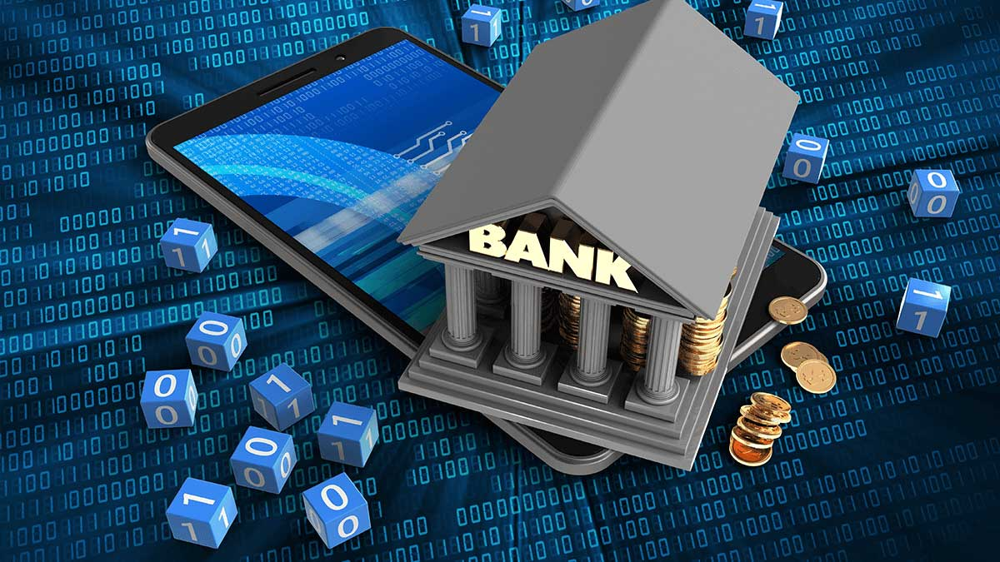

Lending in DeFi is anonymous and trustless. In terms of the model, it is basically in the form of collateralized loans, and the commonly adopted method is over-collateralization. That is to say, people can pledge $200 worth of assets and borrow less than $200 from the lending protocol. This way, there's no need to worry about defaulting on the loan and running away, so people can lend money confidently. This behavior of borrowing tokens with tokens, and even borrowing less and less, seems very foolish, but in fact, it solves real market demands:

1. Demand for trading activities: This includes arbitrage, leverage, and market-making activities. For example, market makers need to borrow funds to meet a large number of transactions; buying tokens on DEX can only go long, but you can short through borrowing; you can even continuously increase leverage by circular loans through collateralized assets (collateralize ETH to borrow USDC to buy ETH, then collateralize again to borrow and buy again).

2. Passive income: idle funds/tokens holders can earn extra income by lending assets during the process of holding tokens.

3. Token incentives: in addition to liquidity mining, leading DeFi protocols have launched staking services based on their native tokens. Token holders can stake to earn more native tokens. Token incentives face all participants of the lending protocol, and borrowers can earn token rewards through interaction, using the tokens obtained from transactions to repay part of the debt.

Compared with traditional mortgage loans such as homes and vehicles, which require human verification of asset ownership and human effort and time for asset auctions in case of default, the pawnshop model in DeFi only needs to stop collateral when the collateral rate is too low, and the liquidation of assets can end the loan contract.

### Operating Model of Lending Protocols

In the case of collateralized borrowing on the blockchain, how many tokens can be borrowed and when to liquidate are all set by a series of parameters in the smart contract.

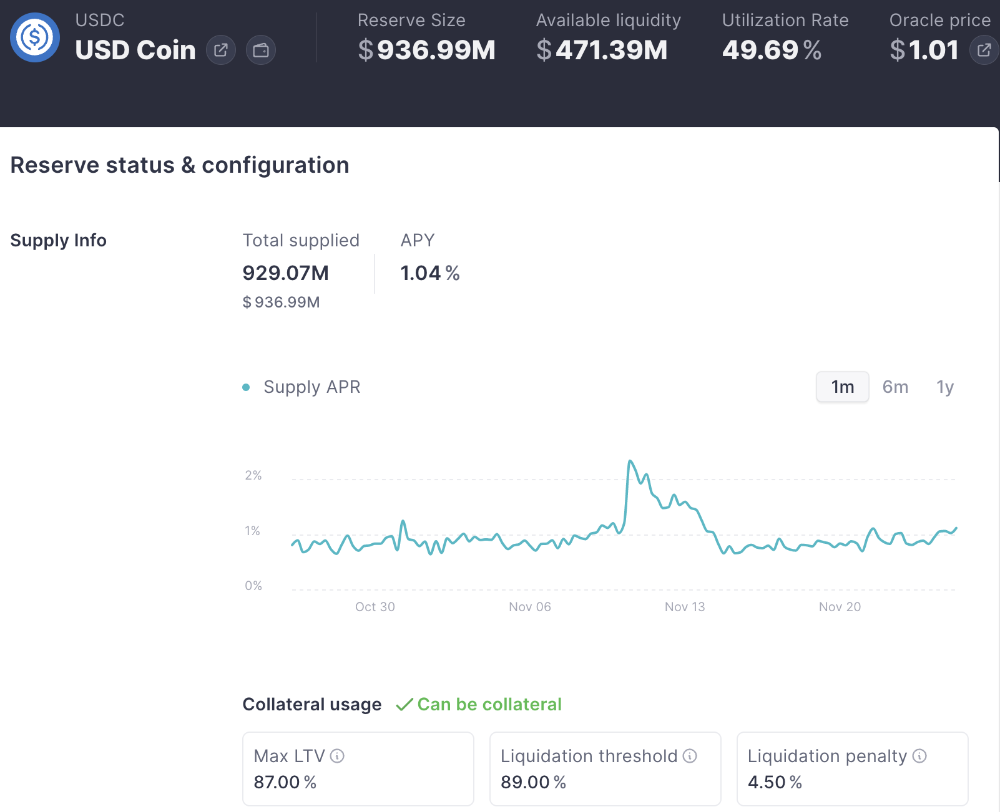

Max LTV (Loan to Value): this determines the maximum ratio of debt to the value of the collateral at the time of borrowing.

Liquidation Threshold: this is a criterion for determining liquidation. Liquidation occurs when the ratio of debt to the value of the collateral rises to this level.

Liquidation Penalty: This is the penalty percentage that needs to be deducted from the collateral when liquidation occurs.

For example, in Aave V2, the Max LTV of USDC is 87%, the Liquidation Threshold is 89%, and the Liquidation Penalty is 4.5%. This means that for every 1 USDC of collateral, you can borrow up to 0.87 USD of other tokens. Liquidation occurs when the value of the borrowed tokens rises to 0.89 USD. In the case of successful liquidation, a 4.5% penalty will be deducted.

The price fluctuation of crypto assets can often be quite volatile. The over-collateralization method used by lending protocols helps to prevent situations where the debts exceed the assets. The diagram below shows different collateralization ratios corresponding to different rates and collateral requirements.

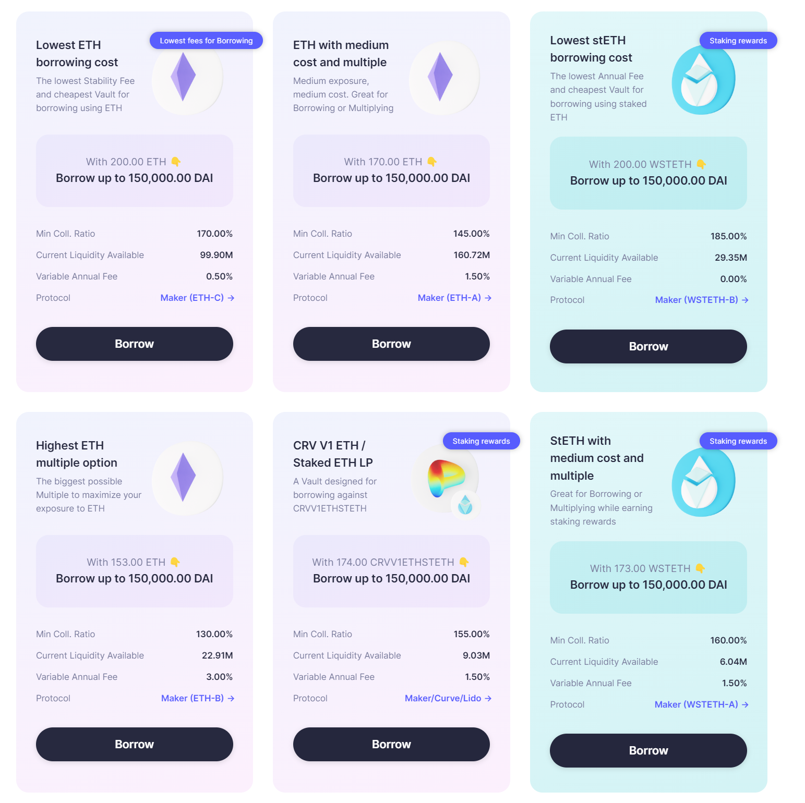

When the collateralized assets or the borrowed assets experience significant fluctuations to a certain extent, lending protocols need to perform liquidation to avoid bad debts. 
Let's take AAVE as an example to see how the lending protocol carries out liquidation. 
First, let's introduce a concept called the Health Factor. The Health Factor is related to the account's collateral and loan amount, indicating the possibility of insolvency. So how do we calculate the Health Factor?

1. Check the liquidation line (Liquidation Threshold) of the collateral. For example, the Liquidation Threshold for USDC at this moment is 0.89.

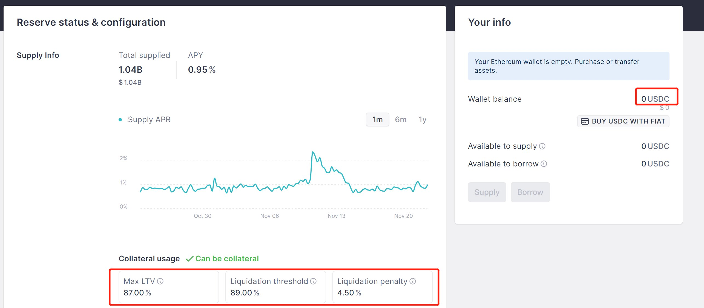

2. `Health Factor` = `Collateral Amount` * `Liquidation Threshold` / `Loaned Assets`. In this casde, `5794 * 0.89 / 4929 = 1.046`;

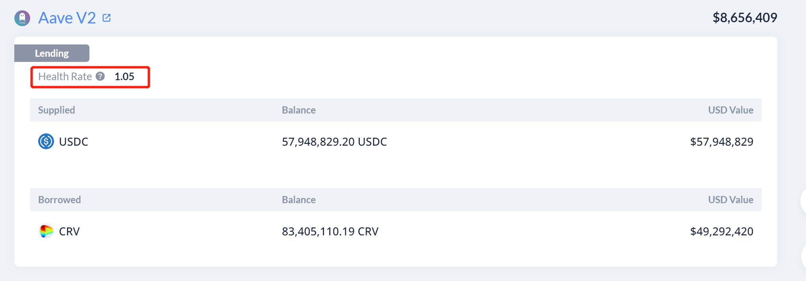

3. If the price of the collateral drops, or the price of the borrowed assets rises, causing the Health Factor to be less than 1, then Liquidation will be performed. The specific liquidation process is as follows:

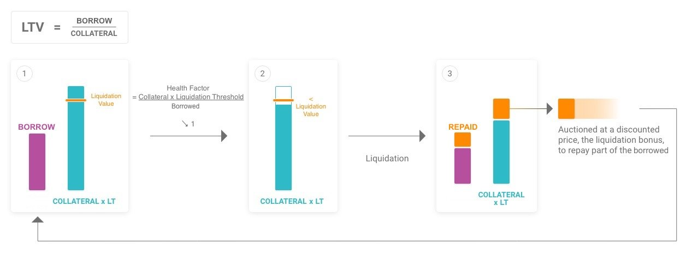

So the actual inequality is: Loaned Assets Amount <= Collateral Amount * LTV < Collateral Amount * Liquidation Threshold. 
During liquidation, the portion exceeding the liquidation line will be auctioned off, and liquidators purchase the collateral. The funds obtained from the auction are used to repay the debt, and the surplus is treated as a reward for the liquidator. 
The liquidation process depends on the feed prices from the oracle, AAVE currently uses Chainlink.

Interestingly, although the idea of over-collateralization seems very reliable, and it appears that lending protocols should not have bad debt risk, is this really the case? The recent incident of Eisenberg shorting CRV through borrowing from AAVE V2 has resulted in approximately $1.7 million in bad debts. The main reason may be that this whale's position was too large, and there was not enough liquidity in the market for liquidators to buy in. From the figure below, you can see that this whale deposited 57.94 million USDC into Aave and borrowed 83.42 million CRV.

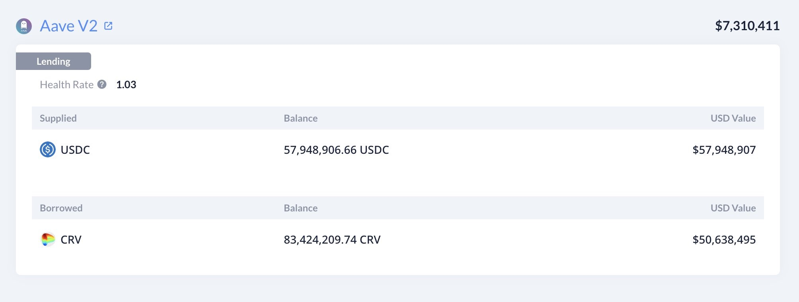

From CoinGecko and blockchain explorers, we can see that the circulating supply of CRV tokens is only 637 million and the amount of CRV borrowed by the whale exceeds that held by all external account holders. For example, as of November 25th, there were only 42.12 million CRV in the Aave contract, and the 8th largest CRV holder, Binance 14, only held 20.21 million CRV. 

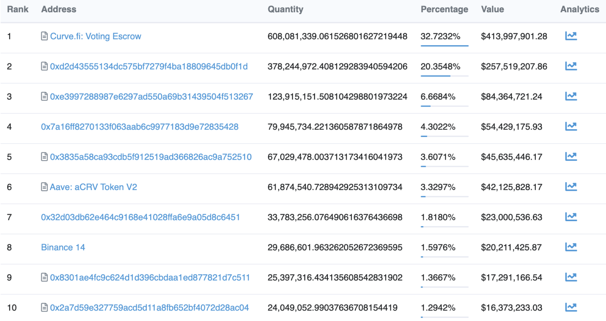

In DEX, the liquidity of the ETH/CRV trading pair with the highest liquidity in Uniswap V3 was only $1.76 million, with only 1.48 million CRV. Therefore, there was not enough liquidity in the market for liquidators to buy in and complete the liquidation. After each liquidation, the remaining funds will be added to the collateral, causing the liquidation price of the remaining debt to rise. However, during the liquidation process, the price of CRV continued to rise, ultimately leading to bad debts in Aave.

To summarize, most lending protocols currently use over-collateralization, and whether to liquidate and how much to liquidate is monitored by the health factor when price fluctuates. Here we only talked about the simplest and most basic lending business. In fact, each protocol has its own features. For example, Compound uses a decentralized peer-to-peer model and the liquidity pool utilization model allows for a high utilization of funds within the pool; AAVE was the first to propose flash loans, where borrowing + operation + repayment are completed within a single block, and atomicity determines that this transaction is either completely successful or completely fails; AAVE V3 even proposes the function of cross-chain asset flow; and Euler, Kashi, and Rari and other lending platforms better meet the needs of long-tail assets through permissionless lending pools.


## Key Indicators to Focus On
After understanding the business logic of Onchain lending protocols, we can start analyzing. Next, we will list some indicators commonly used to evaluate lending protocols. It should be noted that although the flow of funds in smart contracts only goes in and out, the meanings they represent are different and need to be judged in conjunction with smart contracts and blockchain explorers.

### 1. Total Value Locked (TVL)
This indicates how much money is locked in the lending protocol's smart contract. TVL represents the liquidity of the protocol. Looking at the data from [defillama](https://defillama.com/protocols/lending), the total lending market TVL exceeds $10B, and the top five's TVL totals approximately $9.5B, with AAVE alone accounting for $3.9B. 

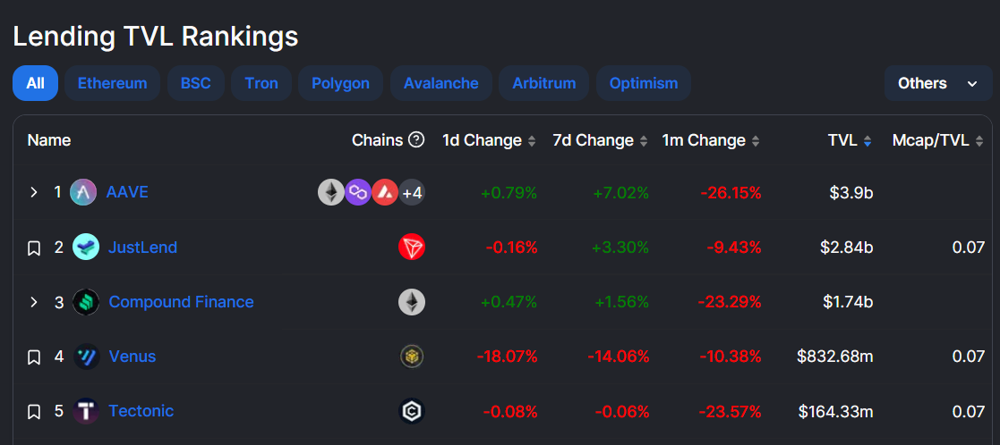

Taking AAVE V3 on Arbitrum as an example, let's look at how to query [TVL](https://dune.com/queries/1042816/1798270).

The basic idea is: in the AAVE smart contract, the amount of money defined as `Supply` is subtracted from the `Withdraw` funds, which equates to the total value locked in the contract. If you open [Arbscan](https://arbiscan.io/address/0x794a61358d6845594f94dc1db02a252b5b4814ad) and find an [AAVE transaction](https://arbiscan.io/tx/0x6b8069b62dc762e81b41651538d211f9a1a33009bcb41798e673d715867b2f29#eventlog), you can open the log and see that `topic0 = 0x2b627736bca15cd5381dcf80b0bf11fd197d01a037c52b927a881a10fb73ba61` corresponds to the `Supply` action in the smart contract.

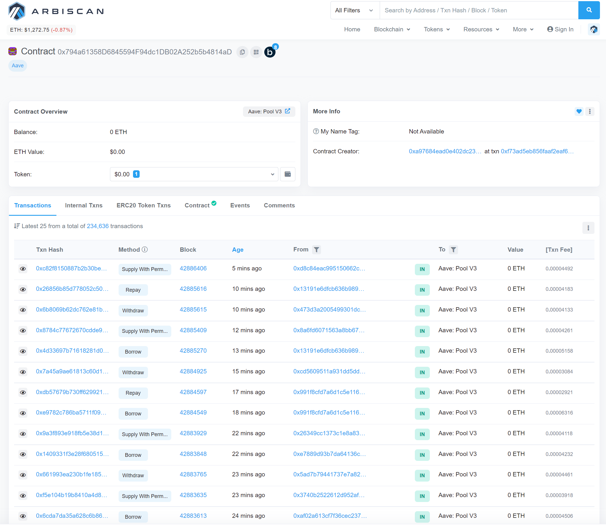


Similarly, `topic0 = 0x3115d1449a7b732c986cba18244e897a450f61e1bb8d589cd2e69e6c8924f9f7` corresponds to the `Withdraw` action (note: in Dune, `topic1` refers to what is known as topic0 in etherscan). In Dune, you select transactions sent to the AAVE V3 contract from the Arbitrum log table, and define the `Deposit` and `Withdraw` actions based on the topic (action_type). Deposits are positive, withdrawals are negative, and their sum is the amount of tokens locked in the contract. Use the `bytearray_ltrim(topic1)` function to get the address of the transferred token, and use the `bytearray_to_uint256(bytearray_substring(data, 1 + 32, 32))` function to get the quantity of the transferred token (not priced in USD).

``` sql
with aave_v3_transactions as (
    select 'Supply' as action_type,
        block_time,
        bytearray_ltrim(topic1) as token_address,
        bytearray_ltrim(topic2) as user_address,
        cast(bytearray_to_uint256(bytearray_substring(data, 1 + 32, 32)) as decimal(38, 0)) as raw_amount,
        tx_hash
    from arbitrum.logs
    where contract_address = 0x794a61358d6845594f94dc1db02a252b5b4814ad   -- Aave: Pool V3
        and topic0 = 0x2b627736bca15cd5381dcf80b0bf11fd197d01a037c52b927a881a10fb73ba61 -- Supply
        and block_time > date('2022-03-16') -- First transaction date
    
    union all
    
    select 'Withdraw' as action_type,
        block_time,
        bytearray_ltrim(topic1) as token_address,
        bytearray_ltrim(topic2) as user_address,
        -1 * cast(bytearray_to_uint256(bytearray_substring(data, 1 + 32, 32)) as decimal(38, 0)) as raw_amount,
        tx_hash
    from arbitrum.logs
    where contract_address = 0x794a61358d6845594f94dc1db02a252b5b4814ad   -- Aave: Pool V3
        and topic0 = 0x3115d1449a7b732c986cba18244e897a450f61e1bb8d589cd2e69e6c8924f9f7 -- Withdraw
        and block_time > date('2022-03-16') -- First transaction date
),

aave_v3_transactions_daily as (
    select date_trunc('day', block_time) as block_date,
        token_address,
        sum(raw_amount) as raw_amount_summary
    from aave_v3_transactions
    group by 1, 2
    order by 1, 2
)

select * from aave_v3_transactions_daily
```

At this point, we have obtained the number of tokens locked in the smart contract. To get the TVL denominated in USD, we also need to match each token with its price. Here, we have manually selected a few mainstream tokens:

``` sql
token_mapping_to_ethereum(aave_token_address, ethereum_token_address, token_symbol) as (
    values
    (0xfd086bc7cd5c481dcc9c85ebe478a1c0b69fcbb9, 0xdac17f958d2ee523a2206206994597c13d831ec7, 'USDT'),
    (0x2f2a2543b76a4166549f7aab2e75bef0aefc5b0f, 0x2260fac5e5542a773aa44fbcfedf7c193bc2c599, 'WBTC'),
    (0xd22a58f79e9481d1a88e00c343885a588b34b68b, 0xdb25f211ab05b1c97d595516f45794528a807ad8, 'EURS'),
    (0xff970a61a04b1ca14834a43f5de4533ebddb5cc8, 0xa0b86991c6218b36c1d19d4a2e9eb0ce3606eb48, 'USDC'),
    (0xf97f4df75117a78c1a5a0dbb814af92458539fb4, 0x514910771af9ca656af840dff83e8264ecf986ca, 'LINK'),
    (0x82af49447d8a07e3bd95bd0d56f35241523fbab1, 0xc02aaa39b223fe8d0a0e5c4f27ead9083c756cc2, 'WETH'),
    (0xda10009cbd5d07dd0cecc66161fc93d7c9000da1, 0x6b175474e89094c44da98b954eedeac495271d0f, 'DAI'),
    (0xba5ddd1f9d7f570dc94a51479a000e3bce967196, 0x7fc66500c84a76ad7e9c93437bfc5ac33e2ddae9, 'AAVE')
),

latest_token_price as (
    select date_trunc('hour', minute) as price_date,
        contract_address,
        symbol,
        decimals,
        avg(price) as price
    from prices.usd
    where contract_address in (
        select ethereum_token_address
        from token_mapping_to_ethereum
    )
    and minute > now() - interval '1' day
    group by 1, 2, 3, 4
),

latest_token_price_row_num as (
    select  price_date,
        contract_address,
        symbol,
        decimals,
        price,
        row_number() over (partition by contract_address order by price_date desc) as row_num
    from latest_token_price
),

current_token_price as (
    select contract_address,
        symbol,
        decimals,
        price
    from latest_token_price_row_num
    where row_num = 1
),
```

Divide the raw amount by the corresponding token's decimal places (for instance, ETH has 18 decimal places, USDT has 6), to get the actual number of tokens. Then multiply this by the corresponding price to get the amount denominated in USD. Summing up these amounts will give the total TVL.

``` sql
daily_liquidity_change as (
    select d.block_date,
        p.symbol,
        d.token_address,
        d.raw_amount_summary / power(10, coalesce(p.decimals, 0)) as original_amount,
        d.raw_amount_summary / power(10, coalesce(p.decimals, 0)) * coalesce(p.price, 1) as usd_amount
    from aave_v3_transactions_daily d
    inner join token_mapping_to_ethereum m on d.token_address = m.aave_token_address
    left join current_token_price p on m.ethereum_token_address = p.contract_address
    order by 1, 2
)

select sum(usd_amount) / 1e6 as total_value_locked_usd
from daily_liquidity_change
```

Reference: https://dune.com/queries/1037796/1798021

### 2. Outstanding Loans

This refers to the amount of money that has been loaned out and has not yet been repaid. Similar to calculating TVL, refer to the data from the blockchain explorer, find the contract function corresponding to topic0(1), and subtract the repaid ('Repay') from the borrowed ('Borrow').

Reference: https://dune.com/queries/1037796/1798021

``` sql
 select 'Borrow' as action_type,
    block_time,
    bytearray_ltrim(topic1) as token_address,
    bytearray_ltrim(topic2) as user_address,
    cast(bytearray_to_uint256(bytearray_substring(data, 1 + 32, 32)) as decimal(38, 0)) as raw_amount,
    tx_hash
from arbitrum.logs
where contract_address = 0x794a61358d6845594f94dc1db02a252b5b4814ad   -- Aave: Pool V3
    and topic0 = 0xb3d084820fb1a9decffb176436bd02558d15fac9b0ddfed8c465bc7359d7dce0 -- Borrow
    and block_time > date('2022-03-16') -- First transaction date

union all

select 'Repay' as action_type,
    block_time,
    bytearray_ltrim(topic1) as token_address,
    bytearray_ltrim(topic2) as user_address,
    -1 * cast(bytearray_to_uint256(bytearray_substring(data, 1 + 32, 32)) as decimal(38, 0)) as raw_amount,
    tx_hash
from arbitrum.logs
where contract_address = 0x794a61358d6845594f94dc1db02a252b5b4814ad   -- Aave: Pool V3
    and topic0 = 0xa534c8dbe71f871f9f3530e97a74601fea17b426cae02e1c5aee42c96c784051 -- Repay
    and block_time > date('2022-03-16') -- First transaction date

limit 100
```


### 3. Capital Efficiency (Utilization Ratio)

Simply put, it refers to how much of the money deposited into the protocol has been truly utilized (borrowed). Currently, the capital efficiency of AAVE V3 on Arbitrum is around 30%, at a low leverage level. Compared to the bull market in 2021, the fund utilization rate was between 40%-80%.


### 4. Detailed Categories

Including the composition of assets locked in the contract and user behavior distribution. Reference: https://dune.com/queries/1026402/1771390.


The top three assets in AAVE's liquidity pool on Arbitrum are WETH (37.6%), USDC (29.5%), and WBTC (22.6%). Currently, we are in a bear market where users' demand for leverage is not strong, so most are primarily depositing to earn interest.

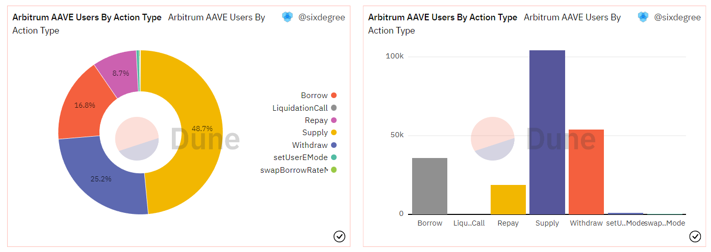

### 5. Basic Indicators

Some basic protocol analysis indicators, such as the number of users, the number of transactions, and daily change situations. Reference: https://dune.com/queries/1026141/1771147.

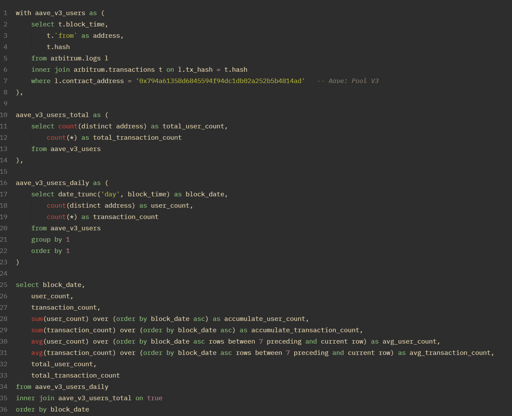

## Lending Dashboard

1. The comprehensive dashboard for AAVE V3 on Arbitrum. 

https://dune.com/sixdegree/aave-on-arbitrum-overview


2. And a dashboard comparing the three classic lending protocols on Ethereum: Maker, AAVE, and Compound. However, this dashboard is old, using the Dune V1 engine. Dune will soon retire V1 and will only use V2 in the future, so you can refer to its thinking when learning.

https://dune.com/datanut/Compound-Maker-and-Aave-Deposits-Loans-LTV

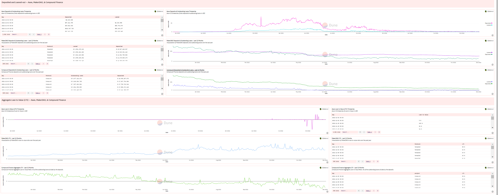

## References
1. https://foresightnews.pro/article/detail/17638
2. https://learnblockchain.cn/article/5036
3. https://twitter.com/0xhiger/status/1595076528697905157
4. https://www.blocktempo.com/why-do-defi-lending-protocols-generate-bad-debts/
5. https://www.panewslab.com/zh/articledetails/k1ep9df5.html
6. https://new.qq.com/rain/a/20201121A096UF00

## About Us

`Sixdegree` is a professional onchain data analysis team Our mission is to provide users with accurate onchain data charts, analysis, and insights. We are committed to popularizing onchain data analysis. By building a community and writing tutorials, among other initiatives, we train onchain data analysts, output valuable analysis content, promote the community to build the data layer of the blockchain, and cultivate talents for the broad future of blockchain data applications. Welcome to the community exchange!

- Website: [sixdegree.xyz](https://sixdegree.xyz)
- Email: [contact@sixdegree.xyz](mailto:contact@sixdegree.xyz)
- Twitter: [twitter.com/SixdegreeLab](https://twitter.com/SixdegreeLab)
- Dune: [dune.com/sixdegree](https://dune.com/sixdegree)
- Github: [https://github.com/SixdegreeLab](https://github.com/SixdegreeLab)
