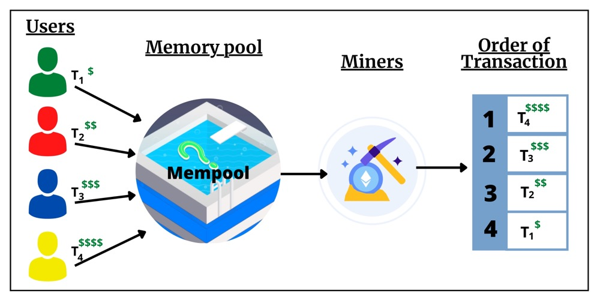
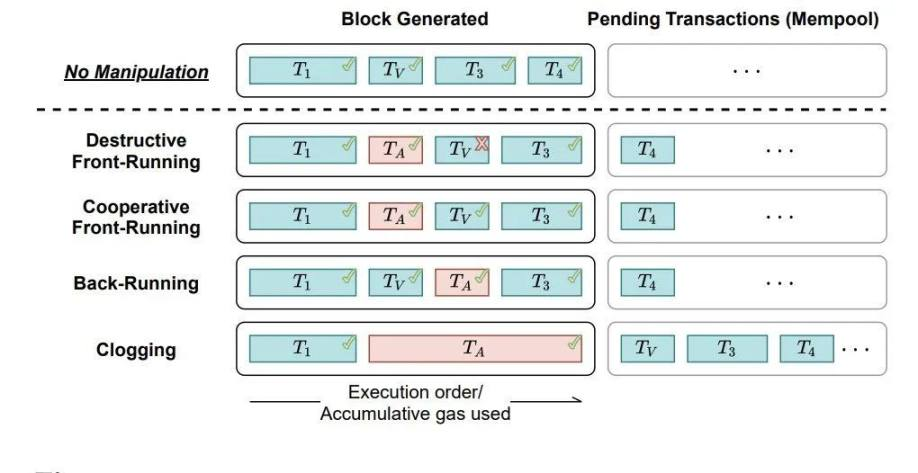
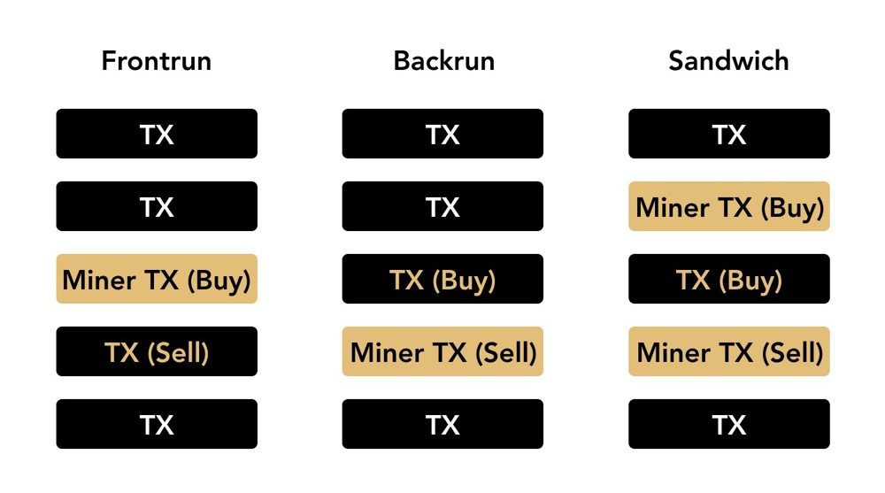
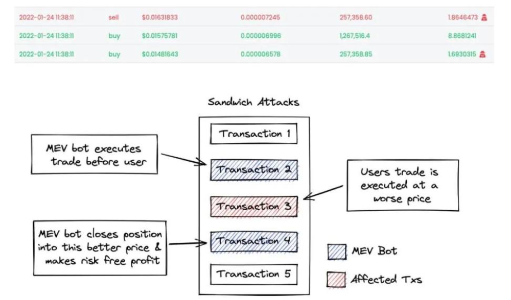
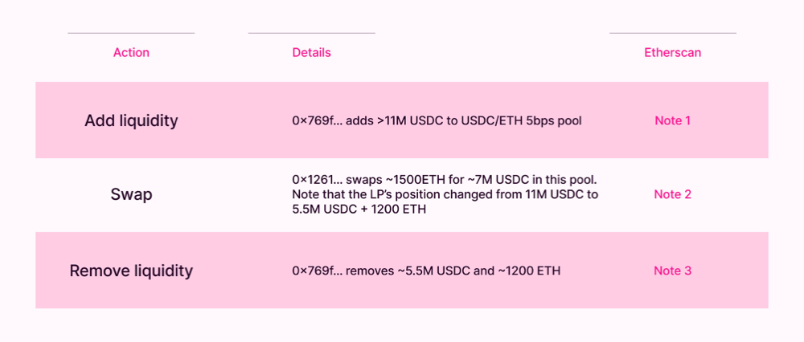
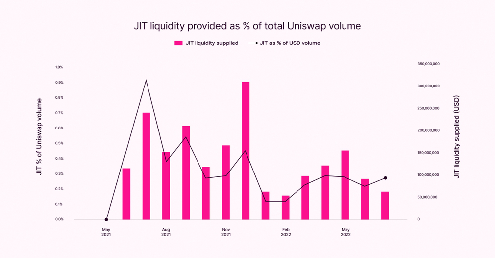
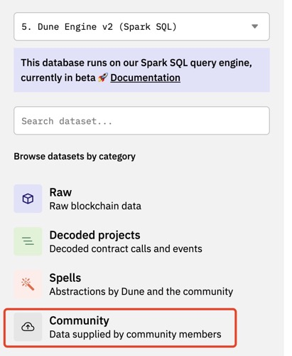
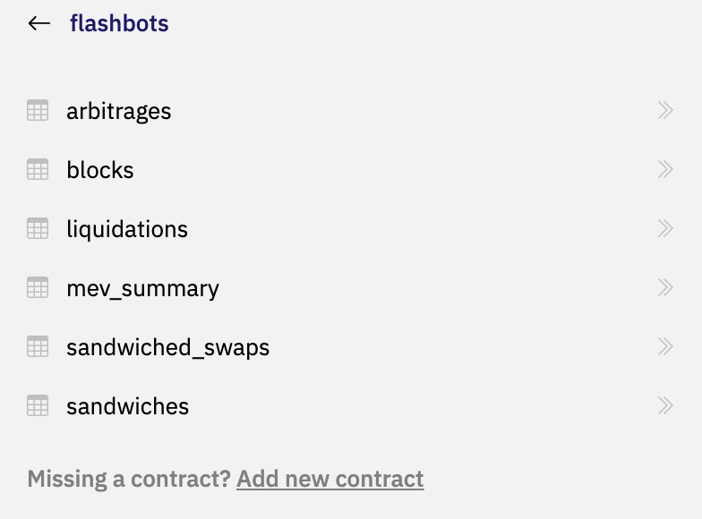

# 17 MEV Data Analysis - Uniswap

## What is MEV?

The concept of MEV (miner-extractable value) first appeared in the Flashboy 2.0 article in 2019, referring to the additional profit that miners can obtain by including, reordering, inserting, or ignoring transactions. With the development of blockchain and Onchain research activities in recent years, MEV has now extended to maximal extractable value.

Visually through data, as shown in the following figure, the MEV profit obtained through arbitrage reached $1.44 million in the past 30 days, during a bear market with relatively low trading volume. The previous market turmoil brought about by the FTX crash incident was just a [bull market for MEV](https://twitter.com/lviswang/status/1591664260987641856?s=20&t=YPM1Qwt_-K8IJGHxxu2gnA), where intense price fluctuations led to an explosion of arbitrage and liquidation opportunities, generating $5 million in arbitrage income in just 7 days. Therefore, MEV is always accompanying the market although ordinary users may not want to, they can't avoid being passively involved in this corner of the dark forest. At least, we should roughly understand what MEV is all about.


Ethereum is the most active mainnet with the richest Onchain activities. Let's discuss a few prerequisites for the birth of MEV on Ethereum:

1. The Gas mechanism of Ethereum is essentially an auction mechanism, where the highest bidder wins, and the transactions are designed to be sequential. That is, miners/validators will package the transactions with the highest gas first to maximize profits. This is one of the reasons for the high gas fees and congestion on Ethereum and it also makes MEV possible: once a profitable transaction is found, it can be executed first by bribing miners (raising gas).

2. The design of the blockchain memory pool (Mempool). All transactions sent out need to temporarily enter the memory pool, rather than being packaged directly by miners. The memory pool is filled with pending transactions and is public, which means anyone can monitor every transaction and every function call in the memory pool, providing attackers with the conditions to monitor transactions. 



3. According to [Etherscan](https://etherscan.io/blocks) data, after the POS merge, the block production time is fixed at 12 seconds; before the POS merge, it was around 13.5 seconds. The longer block production time, which is considered for the safety of node synchronization, also provides attackers with execution time.

In summary, **MEV attackers can see all pending transactions in the public mempool and have ample time to rehearse to see if the transaction can bring profits. If they determine that it is profitable, they can raise the gas fee to achieve the effect of priority execution, thus stealing others' benefits.**



Here's an interesting question - shouldn't Solana, which has no mempool and fast block production speed, have no MEV? In fact, Solana also has MEV, but let's just discuss MEV on Ethereum for now.

So who are the beneficiaries of MEV?

Firstly, miners/validators win passively. The competition between buyers maximizes the income of sellers and the block space market is no exception; Secondly, the initiators of MEV attacks benefit, which is obvious. Can miners/validators get involved in MEV themselves? The answer is certainly yes. The optimal situation is that the miner/validator launches an MEV transaction exactly when they are producing a block. However, in practice, the chance of this happening is really low. The occurrence of MEV also depends somewhat on luck. A lucky validator may produce a block containing a large amount of MEV, while an unlucky one may not have any at all. According to the results of the calculation in the article [Post-Merge MEV: Modelling Validator Returns](https://pintail.xyz/posts/post-merge-mev/), some validators have hardly received any MEV in a year, while the annual return rate of some validators is far more than 100%. On average, MEV brings an additional 1.5% - 3% annual return to validators. Including block rewards, the median annual return rate for validators is roughly 6.1% to 7.6% (based on datasets from the MEV "off-peak" and "peak" periods).


## The Extraction Process of MEV
In the process of MEV extraction, scientists calculate profits and arbitrage paths, write the execution logic into contract code, and use robots to complete the call. If no one finds and executes the same arbitrage path, then only the normal GAS fee needs to be paid to the miner; if someone else finds and executes the same arbitrage path, then a higher GAS must be paid to ensure that one's transaction is completed first.

As transactions on the blockchain are public, profitable arbitrage paths can be filtered and studied, leading to intense GAS competition. And the GAS bidding on the blockchain is public, so the GAS paid to miners can often double several times within the time of a block. Ultimately, if no one drops out, all profits often need to be given to the miner until one party ends the infighting.


## Classification of MEV
MEV robots, according to their creators' intentions, perform Onchain activities, packaging transactions and delivering them to unwitting miners for block production. From a positive perspective, they are important players in ensuring market stability and DApp activity; from a negative perspective, they exploit ordinary users unequally with their inherent advantage (they can monitor the entire Mempool).

Considering that this article mainly introduces the use of Dune for MEV analysis, here is a simple classification of MEV based on Dune-related content:

### 1. Arbitrage
Arbitrage is the most common form of MEV. When the same asset has different prices on different exchanges, there is an arbitrage opportunity. Like high-frequency traders looking for arbitrage opportunities in traditional financial markets, searchers (i.e., those who mine MEV) deploy robots to discover any potential arbitrage opportunities on decentralized exchanges (DEX). AMM mechanism naturally welcomes arbitrage transactions, because the transaction price is no longer determined by the order placer, but by the transaction in the pool, so arbitrage behavior is equivalent to manually synchronizing the price of a DEX trading pair with other DEX/CEX trading pairs, ensuring market fairness and stability, and contributing to the transaction volume and activity of the protocol. So this type of MEV is considered "good" MEV. Note that only when someone discovers arbitrage and replaces the transaction by raising gas to queue jump is arbitrage considered MEV.

### 2.Liquidations
DeFi lending platforms currently adopt an over-collateralized lending model. Naturally, the price of the asset used as collateral will fluctuate over time. If the asset price falls below a certain level, the collateral will be liquidated. Typically, the collateral is sold at a discount, and the person who buys this portion of collateral is known as a liquidator. After the liquidation is completed, they will also receive a reward from the lending platform. As long as there is a liquidation opportunity, there is a chance for transaction replacement, presenting a MEV opportunity. Searchers spot liquidation transactions incoming into the transaction pool, create a transaction identical to the initial liquidation transaction, insert their own transaction, and thus the searcher becomes the liquidator and collects the reward.

This type of MEV accelerates the liquidity of DeFi, providing guarantees for the normal operation of the lending platform, and is also considered a "good" MEV.

### 3. Frontrunning, Backrunning, and Sandwich(ing)
Frontrunning is when MEV bots pay slightly higher gas fees to execute transactions ahead of a certain transaction in the Mempool, such as swapping tokens at a lower price. Backrunning is when bots try different arbitrages, liquidations, or transactions after a transaction causes a significant price displacement. 



Sandwich attacks are a combination of the previous two, sandwiching transactions on both ends. For example, MEV bots place a buy order before the transaction and a sell order after the transaction, causing the user's transaction to execute at a worse price. If the transaction slippage is set unreasonably, it is easy to suffer a sandwich attack. This kind of MEV is obviously "bad".



### 4. Just-in-Time liquidity Attack
JIT liquidity is a special form of liquidity provision. In DEX, liquidity providers share transaction fees. JIT refers to adding liquidity just before a large Swap to share the transaction fee of that transaction and immediately exiting liquidity after the transaction ends. This might sound strange – doesn’t providing liquidity continuously mean continuously receiving transaction fees? Personal opinion is that being an LP brings impermanent loss, while the impermanent loss brought by instantaneous liquidity provision can almost be ignored. JIT attacks are similar to sandwich attacks because they both involve prepositions and postpositions of the victim's transaction; but in the case of JIT, the attacker adds and removes liquidity, rather than buying and selling. This type of MEV increases the liquidity of DEX without harming traders, so it is also a "good" MEV. 



JIT liquidity actually occupies a very small proportion in DEX transactions. Although it sounds very powerful, according to the [Just-in-time Liquidity on the Uniswap Protocol](https://uniswap.org/blog/jit-liquidity) report, in Uniswap, JIT liquidity has always been less than 1%, so it is a kind of MEV with minor impact.




## MEV Analysis with Dune

Here are two ideas for doing MEV analysis with Dune. For related queries, please refer to the [MEV Data Analytics Tutorial](https://dune.com/sixdegree/mev-data-analytics-tutorial).

### 1. Use the `Community Table` from Flashbots
 
As shown in the figure below, among the four types of tables in Dune, the Community Table is a data source provided by external organizations, including data provided by Flashbots. 





[Flashbots](https://www.flashbots.net/) is an MEV research and development organization, established to mitigate the negative externality of MEV on the blockchain. Currently, more than 90% of Ethereum validator nodes are running Flashbots programs. For those interested in Flashbots, you can check out their [research and documentation](https://boost.flashbots.net/) on your own. All we need to know here is that they are an MEV research organization that provides MEV-related data for users to do queries and analysis on Dune.

For a long time, Flashbots' community table had been stopped at September 15, 2022. When writing this article, I checked again and found that the table started updating again from January 9, 2023, which will facilitate our MEV query. The contents of each table and the meanings of the data in each column can be found in Dune's [Flashbots documentation](https://dune.com/docs/reference/tables/community/flashbots/).

Taking the **flashbots\.mev_summary** table as an example, to query miner income:

| **Column Name**                      | **Type**  | **Description**                                        |
| ------------------------------------ | --------- | ------------------------------------------------------ |
| block\_timestamp                     | timestamp | Block timestamp                                        |
| block\_number                        | bigint    | Block number                                           |
| base\_fee\_per\_gas                  | bigint    | Unit gas fee                                       |
| coinbase\_transfer                   | bigint    | Miner's fee directly given to the miner                     |
| error                                | string    | Error                                       |
| gas\_price                           | bigint    | Gas fee                                       |
| gas\_price\_with\_coinbase\_transfer | bigint    | Total gas consumed + miner's fee directly given to the miner |
| gas\_used                            | bigint    | Gas consumed                                     |
| gross\_profit\_usd                   |  double    | Total earnings from the transaction (USD)               |
| miner\_address                       | string    | Miner's address                                   |
| miner\_payment\_usd                  |  double    | Miner's earnings (USD)                   |
| protocol                             | string    | Main interacting protocol                               |
| protocols                            | string    | Protocols involved in the transaction          |
| transaction\_hash                    | string    | Transaction hash                                |
| type                                 | string    | Type of MEV (for example, arbitrage)                       |
| timestamp                            | timestamp | Timestamp of the last file update             |


Here we take a daily basis for statistics, sum the fees paid to miners, and classify them by MEV type, i.e., daily statistics of miner fees paid to miners by each type of MEV. 

``` sql
select date_trunc('day', block_timestamp) as block_date,
    type,
    sum(miner_payment_usd) as miner_revenue_usd
from flashbots.mev_summary
where error is null
group by 1, 2
having sum(miner_payment_usd) <= 100000000 -- exclude outliers
order by 1, 2
```

Generating a Line Chart, we can see that MEV was very active in 2021, but there was a significant decrease in MEV activity in 2022 due to the market turning bearish. At the same time, opportunities for arbitrage and competition are much more intense than liquidations, so naturally, the fees paid to miners are also higher. Another detail, we find that there are a small number of obvious outliers in Flashbots' data, so we have filtered them out in the query. 


Query for reference: [https://dune.com/queries/1883628](https://dune.com/queries/1883628)


The next example query is to find out which project has the most profit generated by arbitrage, i.e., gross profit minus the fees paid to miners.

``` sql
select protocols,
    sum(gross_profit_usd - miner_payment_usd) as mev_pure_profit_usd
from flashbots.mev_summary
where error is null
    and type = 'arbitrage'
    and miner_payment_usd <= 1e9 -- exclude outliers
    and abs(gross_profit_usd) <= 1e9 -- exclude outliers
group by 1
order by 2 desc
```

Generate a Table type of visualization result set and a pie chart for the above query results, and we can get the following results: 


It can be observed that the arbitrage transactions currently recorded by Flashbots primarily involve Uniswap V2, Uniswap V3, Balancer V1, Curve, and Bancor. The majority of arbitrage profits come from the Uniswap protocol.

Query for reference: [https://dune.com/queries/1883757](https://dune.com/queries/1883757)

Considering that `protocols` is a set of multiple different protocols, we can further optimize the above query and split the data. If an arbitrage transaction involves multiple protocols, we can distribute the profits or amounts evenly. This will better show which specific protocol has generated the most arbitrage profits. Fork the above query and modify as follows: 

``` sql
with protocols_profit as (
    select protocols,
        sum(gross_profit_usd - miner_payment_usd) as mev_pure_profit_usd
    from flashbots.mev_summary
    where error is null
        and type = 'arbitrage'
        and miner_payment_usd <= 1e9 -- exclude outliers
        and abs(gross_profit_usd) <= 1e9 -- exclude outliers
    group by 1
),

protocols_profit_array as (
    select protocols,
        mev_pure_profit_usd,
        regexp_extract_all(protocols, '"([0-9a-zA-Z_]+)"', 1) as protocols_array
    from protocols_profit
),

single_protocol_profit as (
    select p.protocol,
        mev_pure_profit_usd / cardinality(protocols_array) as mev_pure_profit_usd,
        protocols_array,
        cardinality(protocols_array) as array_size,
        mev_pure_profit_usd as origin_amount
    from protocols_profit_array
    cross join unnest(protocols_array) as p(protocol)
)

select protocol,
    sum(mev_pure_profit_usd) as mev_pure_profit_usd
from single_protocol_profit
group by 1
order by 2 desc
```

In this query, since the `protocols` field is of string type, we use `regexp_extract_all()` to split it and convert it into an array, defining a CTE `protocols_profit_array` as a transition. The regular expression `"([0-9a-zA-Z_]+)"` matches any combination of alphanumeric characters or underscores enclosed in double quotes. More information can be found in [Trino Regular expression functions#](https://trino.io/docs/current/functions/regexp.html).

Then, in the `single_protocol_profit` CTE, we average the profit amounts based on the cardinality (size) of the array. Using `unnest(protocols_array) as p(protocol)` splits the array and defines it as a table alias and field alias (respectively as `p` and `protocol`). Combined with `cross join`, you can output the split `protocol` values in the SELECT clause.

Finally, we aggregate the split protocols. Adjust the visualization chart's output fields, add the data to the dashboard, and display as follows:


Now we can clearly see that the arbitrage income from Uniswap V2 is as high as $176M, accounting for nearly 70%.

Query for reference: [https://dune.com/queries/1883791](https://dune.com/queries/1883791)

### 2. Establish a query by joining the Labels table of Spellbook with the DeFi Spellbook table
Taking Uniswap as an example:

If we do not rely on the community tables of flashbots, especially when its maintenance may be interrupted, we can also use the `labels.arbitrage_traders` table in Spellbook. 

``` sql
select address
from labels.arbitrage_traders
where blockchain = 'ethereum'
```

We then join the uniswap_v3_ethereum.trades table with the arbitrage traders table and filter the takers (i.e., traders) which are the arbitrage trades. Next, we can count the number of transactions, the total transaction amount, the average transaction amount, count the number of independent trading robots, etc., for MEV arbitrage information. Similarly, we can also query data related to sandwich attacks. 

``` sql
with arbitrage_traders as (
    select address
    from labels.arbitrage_traders
    where blockchain = 'ethereum'
)

select block_date,
    count(*) as arbitrage_transaction_count, 
    sum(amount_usd) as arbitrage_amount,
    avg(amount_usd) as arbitrage_average_amount,
    count(distinct u.taker) as arbitrage_bots_count
from uniswap_v3_ethereum.trades u
inner join arbitrage_traders a on u.taker = a.address
where u.block_date > now() - interval '6' month
group by 1
order by 1
 ```
 
Query for reference: [https://dune.com/queries/1883865](https://dune.com/queries/1883865)

From this, we can further compare the transaction count, transaction amount of MEV robots, and regular users; the proportion of MEV transaction count and transaction volume for each trading pair in Uniswap:

To distinguish whether it is an MEV robot, we still judge by the label table; we only need to judge whether the `taker` is in `arbitrage_traders` to distinguish whether it is an arbitrage robot.

``` sql
with arbitrage_traders as (
    select address
    from labels.arbitrage_traders
    where blockchain = 'ethereum'
),

trade_details as (
    select block_date,
        taker,
        amount_usd,
        tx_hash,
        (case when a.address is null then 'MEV Bot' else 'Trader' end) as trader_type
    from uniswap_v3_ethereum.trades u
    left join arbitrage_traders a on u.taker = a.address
    where u.block_date > now() - interval '6' month
)

select block_date,
    trader_type,
    count(*) as arbitrage_transaction_count, 
    sum(amount_usd) as arbitrage_amount
from trade_details
group by 1, 2
order by 1, 2
```

Generate two Area Chart charts for the above query results, comparing the transaction count and transaction amount proportions of MEV Bots and regular Traders. We then get the following results:


For specific content, you can refer to the query: [https://dune.com/queries/1883887](https://dune.com/queries/1883887)


We can also count the transaction number, transaction amount, etc., for bot and regular user trades by trading pair. We just need to categorize and count with the `token_pair` in the Spellbook, so no more examples will be given here.

## Summary

The above introduced the principle and classification of Ethereum MEV, as well as the two methods on how to use Dune to do MEV queries, using Uniswap as an example. [AndrewHong](https://twitter.com/andrewhong5297) also has a lecture on MEV in the [12-day course of Dune](https://www.youtube.com/watch?v=SMnzCw-NeFE). People who are interested can check out the explanation by the principal of Duniversity, where it is mentioned that Dune's label table is derived from Etherscan and its [coverage](https://dune.com/queries/1764004) may not necessarily be sufficient. Therefore, using the two methods introduced in this article, the final query results may slightly differ. MEV is a complex topic, so here we just aim to provoke thought, as more methods need to be explored.

## References
1. [Understanding the Full Picture of MEV](https://huobi-ventures.medium.com/understanding-the-full-picture-of-mev-4151160b7583)
2. [Foresight Ventures: Describe, Classify, Dominate MEV](https://foresightnews.pro/article/detail/10011)
3. [Flashboy 2.0](https://arxiv.org/pdf/1904.05234.pdf)
4. [Post-Merge MEV: Modelling Validator Returns](https://pintail.xyz/posts/post-merge-mev/)
5. [mev-sandwich-attacks-and-jit](https://dune.com/amdonatusprince/mev-sandwich-attacks-and-jit)
6. [uniswap-v3-mev-activity](https://dune.com/alexth/uniswap-v3-mev-activity)
7. [Just-in-time Liquidity on the Uniswap Protocol](https://uniswap.org/blog/jit-liquidity)
8. [MEV-Who are you working for](https://github.com/33357/smartcontract-apps/blob/main/Robot/MEV_Who_are_you_working_for.md)
9. [mev-data-analytics-tutorial](https://dune.com/sixdegree/mev-data-analytics-tutorial)

## About Us

`Sixdegree` is a professional onchain data analysis team Our mission is to provide users with accurate onchain data charts, analysis, and insights. We are committed to popularizing onchain data analysis. By building a community and writing tutorials, among other initiatives, we train onchain data analysts, output valuable analysis content, promote the community to build the data layer of the blockchain, and cultivate talents for the broad future of blockchain data applications. Welcome to the community exchange!

- Website: [sixdegree.xyz](https://sixdegree.xyz)
- Email: [contact@sixdegree.xyz](mailto:contact@sixdegree.xyz)
- Twitter: [twitter.com/SixdegreeLab](https://twitter.com/SixdegreeLab)
- Dune: [dune.com/sixdegree](https://dune.com/sixdegree)
- Github: [https://github.com/SixdegreeLab](https://github.com/SixdegreeLab)
